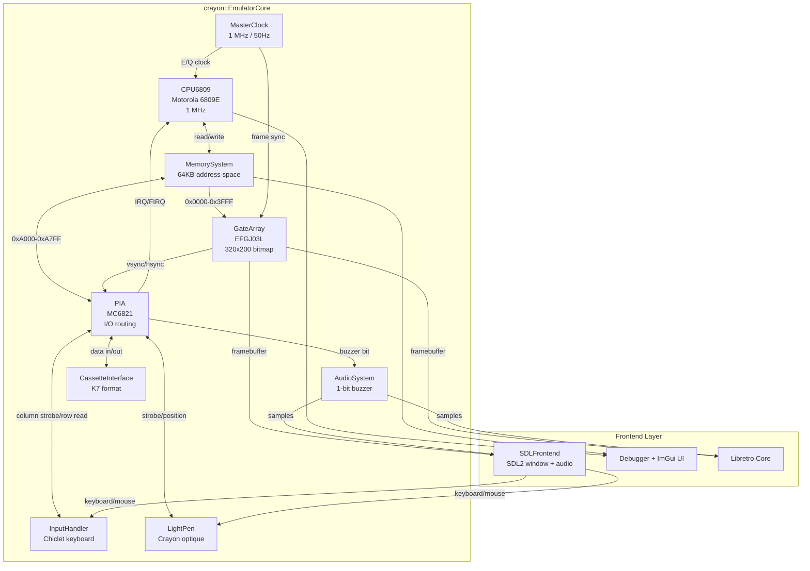
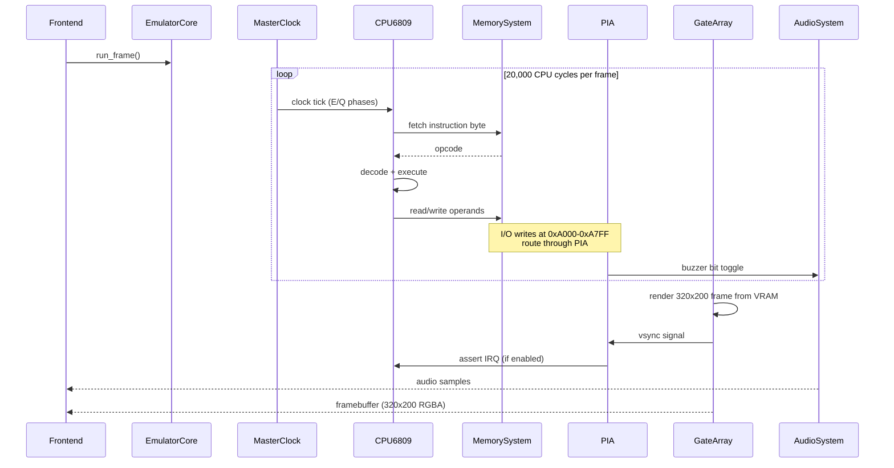
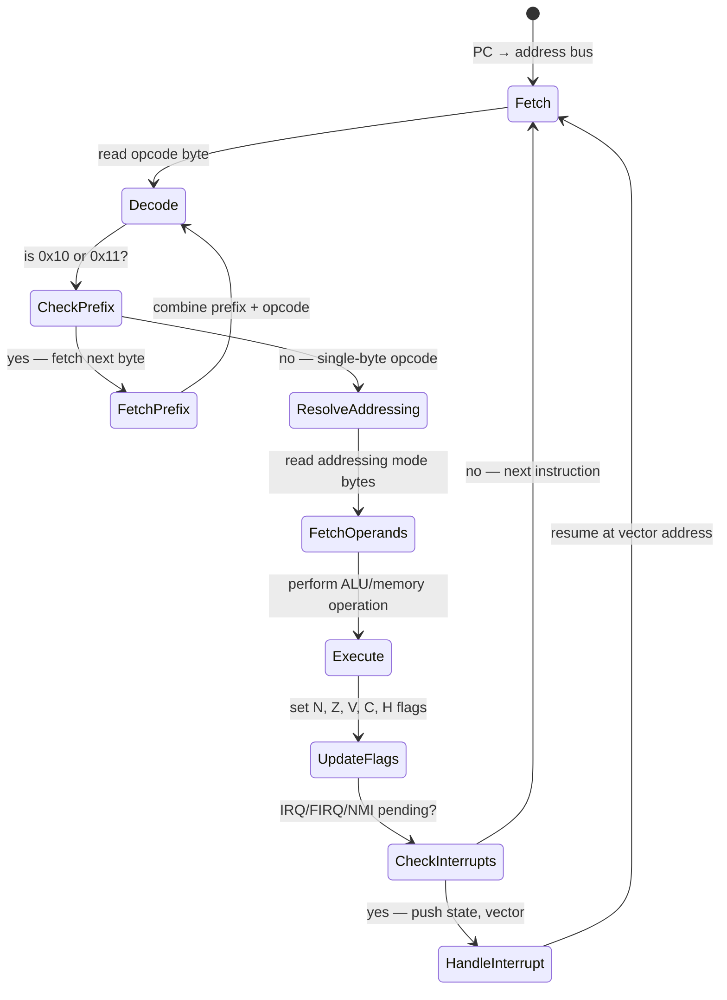
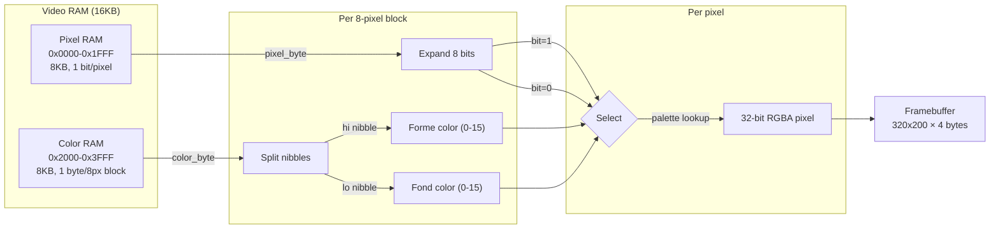
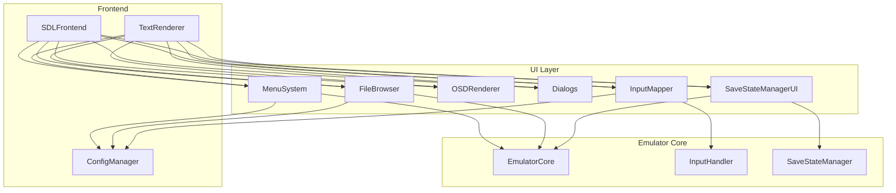
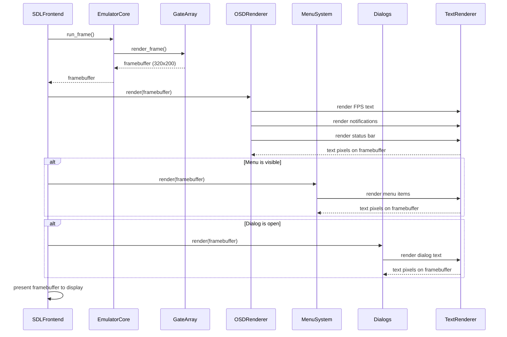

# Design Document: Crayon Thomson MO5 Emulator

## Overview

Crayon is a Thomson MO5 emulator built by forking the existing Videopac/Odyssey 2 emulator and replacing machine-specific components with MO5 equivalents. The Thomson MO5 is a French 8-bit home computer (1984) built around the Motorola 6809E CPU at 1 MHz, with a unique "forme/fond" (shape/background) video system and 48KB of RAM.

The fork strategy is surgical: the Videopac CPU (Intel 8048), VDC (Intel 8245), and memory map are replaced, while shared infrastructure carries over directly. This includes the CMake build system, SDL2 frontend, libretro core structure, ImGui debugger, save state framework, CI/CD pipeline, and GTest/RapidCheck test infrastructure.

### Component Mapping: Videopac → MO5

| Videopac Component | MO5 Replacement | Change Type |
|---|---|---|
| `videopac::CPU` (Intel 8048) | `crayon::CPU6809` (Motorola 6809E) | **Replace** |
| `videopac::VDC` (Intel 8245) | `crayon::GateArray` (EFGJ03L) | **Replace** |
| `videopac::MemorySystem` (1KB ROM + 128B RAM) | `crayon::MemorySystem` (48KB RAM + 16KB ROM) | **Replace** |
| `videopac::InputHandler` (keyboard + joystick) | `crayon::InputHandler` (chiclet keyboard matrix) | **Adapt** |
| `videopac::MasterClock` (NTSC/PAL dual-clock) | `crayon::MasterClock` (1 MHz + 50Hz PAL) | **Simplify** |
| — | `crayon::PIA` (MC6821) | **New** |
| — | `crayon::AudioSystem` (1-bit buzzer) | **New** |
| — | `crayon::LightPen` (crayon optique) | **New** |
| — | `crayon::CassetteInterface` (K7 format) | **New** |
| `videopac::SDLFrontend` | `crayon::SDLFrontend` | **Adapt** |
| `videopac::Debugger` | `crayon::Debugger` | **Adapt** |
| `videopac::SaveStateManager` | `crayon::SaveStateManager` | **Adapt** |
| `videopac::EmulatorCore` | `crayon::EmulatorCore` | **Adapt** |
| Libretro core (`src/libretro.cpp`) | Crayon libretro core | **Adapt** |

### Development Milestones

1. **6809 CPU passing instruction tests** — CoCo/Dragon community test ROMs
2. **Memory map + PIA** — basic I/O, address decoding
3. **Video gate array** — bitmap rendering, forme/fond colors
4. **Boot MO5 BIOS to BASIC prompt** — first real milestone
5. **Cassette loading** — K7 format parsing, fast mode (direct injection), slow mode (1200 baud)
6. **Keyboard input** — chiclet keyboard matrix scanning
7. **Light pen emulation** — crayon optique via mouse
8. **Libretro core + Android** — RetroArch integration

## Architecture

### High-Level Component Diagram



### MO5 Memory Map Layout

```
┌──────────────────────────────────────────────┐ 0xFFFF
│  Monitor ROM (4KB)                           │
│  Reset vector at 0xFFFE, IRQ at 0xFFF8       │
│  FIRQ at 0xFFF6, NMI at 0xFFFC, SWI vectors  │
├──────────────────────────────────────────────┤ 0xF000
│  BASIC 1.0 ROM (12KB)                        │
│  Thomson BASIC interpreter                    │
├──────────────────────────────────────────────┤ 0xC000
│  Reserved (6KB) — reads return 0xFF          │
├──────────────────────────────────────────────┤ 0xA800
│  I/O Space (2KB)                             │
│  PIA registers (MC6821)                      │
│  Gate array control registers                │
├──────────────────────────────────────────────┤ 0xA000
│  User RAM (16KB) / Cartridge ROM             │
│  Switchable: RAM ↔ cartridge at 0x6000-0x9FFF│
├──────────────────────────────────────────────┤ 0x6000
│  User RAM (8KB)                              │
├──────────────────────────────────────────────┤ 0x4000
│  Video RAM — Color Attributes (8KB)          │
│  Each byte: hi nibble=forme, lo nibble=fond  │
├──────────────────────────────────────────────┤ 0x2000
│  Video RAM — Pixel Data (8KB)                │
│  1 bit per pixel, 320x200 = 8000 bytes       │
└──────────────────────────────────────────────┘ 0x0000
```

### Execution Flow: run_frame()

The MO5 master clock is simpler than the Videopac's dual-clock system. The 6809E runs at 1 MHz and the display refreshes at 50Hz (PAL), giving exactly 20,000 CPU cycles per frame.



### 6809E Instruction Execution Cycle



## Components and Interfaces

### CPU6809 (replaces videopac::CPU)

The 6809E is an externally clocked variant of the Motorola 6809. Unlike the 8048's Harvard architecture with separate program/data memory, the 6809 uses a unified 64KB address space.

```cpp
namespace crayon {

class CPU6809 {
public:
    CPU6809();

    void reset();
    uint8_t execute_instruction();  // Returns cycles consumed

    // Memory bus
    void set_memory_system(MemorySystem* mem);
    uint8_t read(uint16_t address);
    void write(uint16_t address, uint8_t value);

    // Interrupts
    void assert_irq(bool active);
    void assert_firq(bool active);
    void assert_nmi();

    // State
    CPU6809State get_state() const;
    void set_state(const CPU6809State& state);

    uint16_t get_pc() const;
    uint64_t get_cycles() const;
};

} // namespace crayon
```

### GateArray (replaces videopac::VDC)

Much simpler than the 8245 VDC — no sprites, no collision detection, no character ROM, no grid system. Just a 320x200 bitmap with per-8-pixel color attributes.

```cpp
namespace crayon {

class GateArray {
public:
    GateArray();

    void reset();
    void render_frame(const uint8_t* pixel_ram, const uint8_t* color_ram);

    // Output
    const uint32_t* get_framebuffer() const;  // 320x200 RGBA

    // Timing signals
    bool vsync_triggered() const;
    void clear_vsync();

    // State
    GateArrayState get_state() const;
    void set_state(const GateArrayState& state);

    // MO5 16-color palette (fixed)
    static constexpr uint32_t PALETTE[16] = {
        0x000000FF, // 0: black
        0xFF0000FF, // 1: red
        0x00FF00FF, // 2: green
        0xFFFF00FF, // 3: yellow
        0x0000FFFF, // 4: blue
        0xFF00FFFF, // 5: magenta
        0x00FFFFFF, // 6: cyan
        0xFFFFFFFF, // 7: white
        0x808080FF, // 8: grey
        0xFF8080FF, // 9: light red
        0x80FF80FF, // 10: light green
        0xFFFF80FF, // 11: light yellow
        0x8080FFFF, // 12: light blue
        0xFF80FFFF, // 13: light magenta
        0x80FFFFFF, // 14: light cyan
        0xFF8000FF  // 15: orange
    };
};

} // namespace crayon
```

### MemorySystem (replaces videopac::MemorySystem)

The MO5 memory map is a flat 64KB space — much simpler than the Videopac's bank-switched Harvard architecture with separate program memory, external RAM, and VDC-gated access.

```cpp
namespace crayon {

class MemorySystem {
public:
    MemorySystem();

    // ROM loading
    Result<void> load_basic_rom(const std::string& path);
    Result<void> load_basic_rom(const uint8_t* data, size_t size);
    Result<void> load_monitor_rom(const std::string& path);
    Result<void> load_monitor_rom(const uint8_t* data, size_t size);
    Result<void> load_cartridge(const std::string& path);
    Result<void> load_cartridge(const uint8_t* data, size_t size);

    // Memory access
    uint8_t read(uint16_t address);
    void write(uint16_t address, uint8_t value);

    // Direct VRAM access (for GateArray rendering)
    const uint8_t* get_pixel_ram() const;   // 0x0000-0x1FFF
    const uint8_t* get_color_ram() const;   // 0x2000-0x3FFF

    // Peripheral connections
    void set_pia(PIA* pia);
    void set_gate_array(GateArray* ga);

    // Cartridge management
    void insert_cartridge();
    void remove_cartridge();
    bool has_cartridge() const;

    // State
    MO5MemoryState get_state() const;
    void set_state(const MO5MemoryState& state);
};

} // namespace crayon
```

### PIA — MC6821 Peripheral Interface Adapter (new component)

The PIA is the central I/O hub of the MO5, replacing the Videopac's direct port-based I/O. It connects the keyboard, cassette, light pen, and interrupt routing.

```cpp
namespace crayon {

class PIA {
public:
    PIA();

    void reset();

    // Register access (from MemorySystem)
    uint8_t read_register(uint8_t reg);   // reg 0-3 (mirrored in I/O space)
    void write_register(uint8_t reg, uint8_t value);

    // Peripheral connections
    void set_input_handler(InputHandler* input);
    void set_cassette(CassetteInterface* cass);
    void set_light_pen(LightPen* lp);
    void set_audio(AudioSystem* audio);

    // Interrupt signals (active-high to CPU)
    bool irq_active() const;
    bool firq_active() const;

    // External signals
    void signal_vsync();       // From GateArray
    void signal_lightpen();    // From LightPen

    // State
    PIAState get_state() const;
    void set_state(const PIAState& state);
};

} // namespace crayon
```

#### PIA Register Layout

```
Register 0 (0xA000): DRA/DDRA — Port A data/direction
  - When CRA bit 2 = 0: access DDRA (data direction)
  - When CRA bit 2 = 1: access DRA (data register)
  - Port A connects to: keyboard column strobe (output),
    cassette data out, light pen button

Register 1 (0xA001): CRA — Port A control
  - Bit 0-1: CA1 interrupt control (vsync from gate array)
  - Bit 2:   DDR/DR access select
  - Bit 3-5: CA2 control (cassette motor)
  - Bit 6:   CA2 interrupt flag (read-only, cleared on read)
  - Bit 7:   CA1 interrupt flag (read-only, cleared on read)

Register 2 (0xA002): DRB/DDRB — Port B data/direction
  - When CRB bit 2 = 0: access DDRB
  - When CRB bit 2 = 1: access DRB
  - Port B connects to: keyboard row input, cassette data in,
    light pen strobe, buzzer output bit

Register 3 (0xA003): CRB — Port B control
  - Bit 0-1: CB1 interrupt control (light pen strobe)
  - Bit 2:   DDR/DR access select
  - Bit 3-5: CB2 control
  - Bit 6:   CB2 interrupt flag (read-only, cleared on read)
  - Bit 7:   CB1 interrupt flag (read-only, cleared on read)
```

### AudioSystem (new component, replaces videopac VDC audio)

The MO5 audio is dramatically simpler than the Videopac's 24-bit shift register system — just a single bit toggled through the PIA.

```cpp
namespace crayon {

class AudioSystem {
public:
    AudioSystem();

    void reset();
    void set_buzzer_bit(bool on);
    void generate_samples(int cpu_cycles);

    // Output
    void fill_audio_buffer(int16_t* buffer, size_t samples);
    size_t samples_available() const;

    // State
    AudioState get_state() const;
    void set_state(const AudioState& state);

private:
    static constexpr size_t RING_BUFFER_SIZE = 4096;
    int16_t ring_buffer_[RING_BUFFER_SIZE];
    size_t write_pos_;
    size_t read_pos_;
    bool buzzer_state_;
    uint32_t sample_accumulator_;
};

} // namespace crayon
```

### InputHandler (adapted from videopac::InputHandler)

The MO5 chiclet keyboard is a matrix scanned through the PIA, replacing the Videopac's joystick + keyboard model. The matrix layout changes but the scanning mechanism is similar.

```cpp
namespace crayon {

// MO5 keyboard matrix: 8 columns × 8 rows
// Column selected by PIA Port A output, row read from PIA Port B input
enum class MO5Key : uint8_t {
    // Row 0
    N = 0x00, EFF = 0x01, J = 0x02, H = 0x03,
    U = 0x04, Y = 0x05, Key7 = 0x06, Key6 = 0x07,
    // Row 1
    Comma = 0x10, INS = 0x11, K = 0x12, G = 0x13,
    I = 0x14, T = 0x15, Key8 = 0x16, Key5 = 0x17,
    // ... (remaining rows follow MO5 matrix layout)
    // Row 7
    SHIFT = 0x70, STOP = 0x71, /* ... */
};

class InputHandler {
public:
    InputHandler();

    void reset();
    void set_key_state(uint8_t row, uint8_t col, bool pressed);
    void set_key_state(MO5Key key, bool pressed);
    uint8_t read_keyboard_row(uint8_t column_strobe);

    // Host key mapping
    void map_host_key(int host_key, MO5Key mo5_key);
    void process_host_key(int host_key, bool pressed);

    // State
    InputState get_state() const;
    void set_state(const InputState& state);

private:
    bool keyboard_matrix_[8][8];  // [column][row]
    std::map<int, MO5Key> key_mapping_;
};

} // namespace crayon
```

### LightPen (new component)

The crayon optique is unique to Thomson machines. It's emulated by mapping the host mouse position to MO5 screen coordinates and generating a strobe signal at the correct time relative to the video scan.

```cpp
namespace crayon {

class LightPen {
public:
    LightPen();

    void reset();
    void set_mouse_position(int x, int y, int window_w, int window_h);
    void set_button_pressed(bool pressed);
    void update(uint16_t beam_x, uint16_t beam_y);

    // PIA interface
    bool strobe_active() const;
    bool button_pressed() const;
    uint16_t get_screen_x() const;
    uint16_t get_screen_y() const;
    bool is_detected() const;

    // State
    LightPenState get_state() const;
    void set_state(const LightPenState& state);

private:
    int mo5_x_, mo5_y_;       // MO5 screen coords (0-319, 0-199)
    bool detected_;            // Mouse within display area
    bool button_;              // Mouse button state
    bool strobe_;              // Strobe signal to PIA
};

} // namespace crayon
```

### CassetteInterface (new component)

Handles K7 format file I/O with two loading modes: fast (direct data injection, default)
and slow (real-time 1200 baud audio simulation). The fast mode intercepts the ROM's
cassette read routine to bypass bit-by-bit polling, while the slow mode presents bits
through the gate array register at authentic timing.

#### K7 File Format

The `.k7` file is a raw dump of the modulated cassette data stream. The Thomson cassette
protocol structures data as follows:

```
┌─────────────────────────────────────────────────────┐
│  Leader: repeated 0x01 bytes (synchronization tone) │
├─────────────────────────────────────────────────────┤
│  Sync byte: 0x3C (marks start of a block)           │
├─────────────────────────────────────────────────────┤
│  Block type: 0x00 = header, 0x01 = data, 0xFF = EOF │
├─────────────────────────────────────────────────────┤
│  Block length: 1 byte (number of data bytes)        │
├─────────────────────────────────────────────────────┤
│  Data payload: 0..255 bytes                         │
├─────────────────────────────────────────────────────┤
│  Checksum: 1 byte (sum of type + length + data)     │
└─────────────────────────────────────────────────────┘
```

Header block (type 0x00) payload contains: filename (8 bytes, space-padded),
file type (1 byte: 0x00=BASIC, 0x01=data, 0x02=machine code), mode (1 byte),
and for machine code: start address (2 bytes) and exec address (2 bytes).

#### Fast Loading Strategy

The fast mode intercepts the ROM's cassette byte-read routine. When the CPU's PC
reaches the known entry point of the Monitor ROM's "read one byte from cassette"
subroutine, the emulator:

1. Reads the next byte from the parsed K7 block data
2. Places it in the A register (or wherever the ROM routine returns it)
3. Sets/clears the carry flag to indicate success/failure
4. Advances PC past the routine (to the RTS or return point)

This requires identifying the exact entry and exit points of the cassette read routine
in the Monitor ROM via disassembly (task 11.6). The interception is done in
`EmulatorCore::run_frame()` by checking PC after each instruction (similar to a
breakpoint).

For LOADM (machine code), the fast loader can go further: parse the entire K7 file,
extract all data blocks, and write them directly to the target RAM addresses specified
in the header block — completing the entire load in one step.

#### Slow Loading Strategy

The slow mode presents bits through gate array register $A7C0 bit 7 at 1200 baud
(~833 CPU cycles per bit). The ROM's cassette read routine polls this bit naturally.
This mode is cycle-accurate and produces authentic loading times.

#### Auto-Play Behavior

On real hardware, the user types `LOAD""` first, then presses PLAY on the tape player.
The ROM activates the motor via PIA CA2, and the tape starts. In the emulator, this
maps to auto-play: when the ROM's cassette read routine starts polling $A7C0 bit 7
and a K7 file is loaded but not playing, the emulator automatically starts playback.
This is equivalent to the motor control activating the tape drive — no manual "press
PLAY" step is needed. The auto-play is triggered by `read_data_bit()` detecting a
read while the tape is loaded but stopped.

```cpp
namespace crayon {

enum class CassetteLoadMode {
    Fast,   // Direct data injection (default)
    Slow    // Real-time 1200 baud audio simulation
};

// Parsed K7 block
struct K7Block {
    uint8_t type;           // 0x00=header, 0x01=data, 0xFF=EOF
    std::vector<uint8_t> data;
    uint8_t checksum;
};

// Parsed K7 file
struct K7File {
    std::vector<K7Block> blocks;
    std::string filename;       // From header block
    uint8_t file_type;          // 0x00=BASIC, 0x01=data, 0x02=machine code
    uint16_t start_address;     // For machine code
    uint16_t exec_address;      // For machine code
};

class CassetteInterface {
public:
    CassetteInterface();

    Result<void> load_k7(const std::string& path);
    Result<void> save_k7(const std::string& path);

    void reset();
    void play(uint64_t current_master_cycle);
    void stop();
    void rewind(uint64_t current_master_cycle);

    // Slow mode: PIA/gate array interface
    bool read_data_bit();
    void write_data_bit(bool bit);
    void update_cycle(uint64_t cycle);

    // Fast mode: direct data injection
    // Called by EmulatorCore when PC hits cassette read entry point
    bool try_fast_read_byte(uint8_t& out_byte);
    bool try_fast_load(MemorySystem& memory, CPU6809& cpu);

    // Mode control
    void set_load_mode(CassetteLoadMode mode);
    CassetteLoadMode get_load_mode() const;

    // K7 format parsing
    Result<K7File> parse_k7(const std::vector<uint8_t>& raw_data);
    std::vector<uint8_t> serialize_k7(const K7File& file);

    // State
    CassetteState get_state() const;
    void set_state(const CassetteState& state);

    bool is_playing() const;
    bool is_recording() const;
    bool has_data() const;
    const K7File& get_parsed_file() const;

private:
    CassetteState state_;
    K7File parsed_file_;
    CassetteLoadMode load_mode_ = CassetteLoadMode::Fast;
    size_t current_block_ = 0;
    size_t block_byte_pos_ = 0;
};

} // namespace crayon
```

### MasterClock (simplified from videopac::MasterClock)

The MO5 timing is much simpler than the Videopac's dual NTSC/PAL master clock with separate CPU and VDC divisors. The 6809E runs at a flat 1 MHz, and the display is 50Hz PAL.

```cpp
namespace crayon {

class MasterClock {
public:
    MasterClock();

    void reset();
    void tick();

    bool cpu_ready() const;
    bool frame_complete() const;
    void clear_frame_complete();

    uint64_t get_cycle_count() const;
    uint32_t get_current_scanline() const;
    uint32_t get_scanline_cycle() const;

    // Constants
    static constexpr uint32_t CPU_CLOCK_HZ = 1000000;       // 1 MHz
    static constexpr uint32_t FRAME_RATE_HZ = 50;           // 50 Hz PAL
    static constexpr uint32_t CYCLES_PER_FRAME = 20000;     // 1MHz / 50Hz
    static constexpr uint32_t SCANLINES_PER_FRAME = 312;    // PAL
    static constexpr uint32_t VISIBLE_SCANLINES = 200;
    static constexpr uint32_t CYCLES_PER_SCANLINE = 64;     // ~64 cycles/line

private:
    uint64_t total_cycles_;
    uint32_t frame_cycle_;
    uint32_t scanline_;
    uint32_t scanline_cycle_;
    bool frame_complete_;
};

} // namespace crayon
```

### EmulatorCore (adapted from videopac::EmulatorCore)

Same interface pattern as the Videopac EmulatorCore, with MO5 components swapped in.

```cpp
namespace crayon {

struct Configuration {
    std::string basic_rom_path;
    std::string monitor_rom_path;
    bool enable_profile;

    Configuration() : enable_profile(false) {}
};

class EmulatorCore {
public:
    explicit EmulatorCore(const Configuration& config);

    // ROM loading
    Result<void> load_roms(const std::string& basic_path,
                           const std::string& monitor_path);
    Result<void> load_cartridge(const std::string& path);

    // Emulation control
    void reset();
    void run_frame();
    void step();

    // Output
    const uint32_t* get_framebuffer() const;
    void get_audio_buffer(int16_t* buffer, size_t samples);

    // Input
    InputHandler& get_input_handler();
    LightPen& get_light_pen();

    // Cassette
    CassetteInterface& get_cassette();

    // State management
    Result<void> save_state(const std::string& path);
    Result<void> load_state(const std::string& path);

    // Component access (for debugger)
    CPU6809& get_cpu();
    GateArray& get_gate_array();
    MemorySystem& get_memory();
    PIA& get_pia();
    MasterClock& get_master_clock();

    // State access
    CPU6809State get_cpu_state() const;
    GateArrayState get_gate_array_state() const;
    MO5MemoryState get_memory_state() const;
    PIAState get_pia_state() const;

    // Debugger
    void set_debugger(Debugger* debugger);

    bool is_running() const;
    bool is_paused() const;
    void set_paused(bool paused);
    uint64_t get_frame_count() const;

private:
    Configuration config_;
    CPU6809 cpu_;
    GateArray gate_array_;
    MemorySystem memory_;
    PIA pia_;
    AudioSystem audio_;
    InputHandler input_;
    LightPen light_pen_;
    CassetteInterface cassette_;
    MasterClock master_clock_;
    Debugger* debugger_;
    bool running_;
    bool paused_;
    uint64_t frame_count_;

    void handle_interrupts();
};

} // namespace crayon
```

### Forme/Fond Video Rendering Pipeline

The EFGJ03L gate array renders each frame by walking through Video RAM in lockstep: one byte of pixel data paired with one byte of color attributes.



Rendering pseudocode:
```
for y in 0..199:
    for block in 0..39:          // 320 pixels / 8 = 40 blocks per line
        offset = y * 40 + block
        pixel_byte = vram[0x0000 + offset]
        color_byte = vram[0x2000 + offset]
        forme = PALETTE[(color_byte >> 4) & 0x0F]
        fond  = PALETTE[color_byte & 0x0F]
        for bit in 7 downto 0:
            framebuffer[y][block*8 + (7-bit)] =
                (pixel_byte & (1 << bit)) ? forme : fond
```

### UI Layer Components (Requirement 19)

The UI layer provides user interaction, configuration management, and visual feedback. All components are carried over from the Videopac codebase and adapted for MO5-specific file types and settings.

#### MenuSystem

Provides in-game overlay menu for file loading, emulator control, and settings.

```cpp
namespace crayon {

enum class MenuAction {
    None,
    LoadBasicROM,
    LoadMonitorROM,
    LoadCartridge,
    LoadK7,
    Reset,
    Pause,
    Resume,
    SaveState,
    LoadState,
    Screenshot,
    ToggleFPS,
    ToggleDebugger,
    ToggleFullscreen,
    Quit
};

struct MenuItem {
    std::string label;
    MenuAction action;
    std::vector<MenuItem> submenu;
    bool enabled;
    std::string shortcut;
};

class MenuSystem {
public:
    MenuSystem();

    void initialize(TextRenderer* text_renderer, ConfigManager* config);
    void render(uint32_t* framebuffer, int width, int height);
    void handle_input(int key, bool pressed);

    bool is_visible() const;
    void show();
    void hide();
    void toggle();

    MenuAction get_selected_action();
    void clear_action();

private:
    std::vector<MenuItem> menu_items_;
    size_t selected_index_;
    std::vector<size_t> submenu_stack_;
    bool visible_;
    TextRenderer* text_renderer_;
    ConfigManager* config_;
};

} // namespace crayon
```

#### ConfigManager

Manages INI-based configuration persistence for all user preferences.

```cpp
namespace crayon {

struct VideoConfig {
    enum class ScalingFilter { Nearest, Linear, Sharp };
    enum class AspectRatio { Original, Stretch, Fit };

    ScalingFilter scaling_filter;
    AspectRatio aspect_ratio;
    bool fullscreen;
    int window_scale;  // Integer scale factor (1-5)
};

struct AudioConfig {
    float volume;       // 0.0 - 1.0
    bool muted;
    int buffer_size;    // Samples
};

struct OSDConfig {
    enum class Position { TopLeft, TopRight, BottomLeft, BottomRight };

    bool fps_enabled;
    Position fps_position;
    float opacity;      // 0.0 - 1.0
    int notification_duration_ms;
};

struct GeneralConfig {
    std::string last_cartridge_dir;
    std::string last_rom_dir;
    std::string last_k7_dir;
    bool auto_load_last_file;
    std::vector<std::string> recent_files;
    int max_recent_files;
};

class ConfigManager {
public:
    ConfigManager();

    Result<void> load(const std::string& path);
    Result<void> save(const std::string& path);
    Result<void> load_default();  // Load from default location

    VideoConfig& video();
    AudioConfig& audio();
    OSDConfig& osd();
    GeneralConfig& general();

    const VideoConfig& video() const;
    const AudioConfig& audio() const;
    const OSDConfig& osd() const;
    const GeneralConfig& general() const;

    void add_recent_file(const std::string& path);

private:
    VideoConfig video_config_;
    AudioConfig audio_config_;
    OSDConfig osd_config_;
    GeneralConfig general_config_;
    std::string config_path_;
};

} // namespace crayon
```

#### FileBrowser

Interactive file picker with directory navigation and extension filtering.

```cpp
namespace crayon {

enum class FileType {
    Cartridge,  // .rom, .bin
    ROM,        // .rom, .bin
    K7,         // .k7
    SaveState,  // .state
    Any
};

struct FileEntry {
    std::string name;
    std::string full_path;
    bool is_directory;
    size_t size;
};

class FileBrowser {
public:
    FileBrowser();

    void initialize(TextRenderer* text_renderer, ConfigManager* config);
    void open(FileType type, const std::string& initial_dir = "");
    void close();

    void render(uint32_t* framebuffer, int width, int height);
    void handle_input(int key, bool pressed);

    bool is_open() const;
    bool has_selection() const;
    std::string get_selected_path();

private:
    void scan_directory(const std::string& path);
    void navigate_up();
    void navigate_into(const std::string& dir);
    bool matches_filter(const std::string& filename) const;

    std::vector<FileEntry> entries_;
    std::string current_dir_;
    size_t selected_index_;
    FileType filter_type_;
    bool open_;
    std::string selected_path_;
    TextRenderer* text_renderer_;
    ConfigManager* config_;
};

} // namespace crayon
```

#### OSDRenderer

On-screen display for FPS counter, notifications, and status bar.

```cpp
namespace crayon {

struct Notification {
    std::string message;
    uint32_t start_time_ms;
    uint32_t duration_ms;
};

class OSDRenderer {
public:
    OSDRenderer();

    void initialize(TextRenderer* text_renderer, ConfigManager* config);
    void render(uint32_t* framebuffer, int width, int height, uint32_t current_time_ms);

    void set_fps(float fps);
    void show_notification(const std::string& message, uint32_t duration_ms = 3000);
    void set_status(const std::string& status);

    void set_fps_enabled(bool enabled);
    bool is_fps_enabled() const;

private:
    void render_fps(uint32_t* framebuffer, int width, int height);
    void render_notifications(uint32_t* framebuffer, int width, int height, uint32_t current_time_ms);
    void render_status_bar(uint32_t* framebuffer, int width, int height);

    float current_fps_;
    std::vector<Notification> notifications_;
    std::string status_text_;
    TextRenderer* text_renderer_;
    ConfigManager* config_;
};

} // namespace crayon
```

#### Dialogs

Modal dialog components for user interaction.

```cpp
namespace crayon {

enum class DialogResult {
    None,
    OK,
    Cancel,
    Yes,
    No
};

class MessageDialog {
public:
    MessageDialog();

    void show(const std::string& title, const std::string& message);
    void close();

    void render(uint32_t* framebuffer, int width, int height);
    void handle_input(int key, bool pressed);

    bool is_open() const;
    DialogResult get_result();

private:
    std::string title_;
    std::string message_;
    bool open_;
    DialogResult result_;
};

class ConfirmDialog {
public:
    ConfirmDialog();

    void show(const std::string& title, const std::string& message);
    void close();

    void render(uint32_t* framebuffer, int width, int height);
    void handle_input(int key, bool pressed);

    bool is_open() const;
    DialogResult get_result();

private:
    std::string title_;
    std::string message_;
    bool open_;
    DialogResult result_;
    bool yes_selected_;  // true = Yes, false = No
};

class ProgressDialog {
public:
    ProgressDialog();

    void show(const std::string& title, const std::string& message);
    void update_progress(float progress);  // 0.0 - 1.0
    void close();

    void render(uint32_t* framebuffer, int width, int height);

    bool is_open() const;

private:
    std::string title_;
    std::string message_;
    float progress_;
    bool open_;
};

} // namespace crayon
```

#### InputMapper

Input configuration UI for keyboard remapping and joystick setup.

```cpp
namespace crayon {

struct JoystickInput {
    int device_id;
    int button;
    int axis;
    int hat;
};

struct JoystickInfo {
    int device_id;
    std::string name;
    int num_buttons;
    int num_axes;
    int num_hats;
};

class InputMapper {
public:
    InputMapper();

    void initialize(TextRenderer* text_renderer, ConfigManager* config);
    void open();
    void close();

    void render(uint32_t* framebuffer, int width, int height);
    void handle_input(int key, bool pressed);

    bool is_open() const;

    // Keyboard mapping
    void set_key_mapping(MO5Key mo5_key, int host_key);
    int get_key_mapping(MO5Key mo5_key) const;

    // Joystick configuration
    void detect_joysticks();
    std::vector<JoystickInfo> get_joysticks() const;
    void map_joystick_button(MO5Key mo5_key, const JoystickInput& input);

    Result<void> save_mappings();
    Result<void> load_mappings();

private:
    std::map<MO5Key, int> key_mappings_;
    std::map<MO5Key, JoystickInput> joystick_mappings_;
    std::vector<JoystickInfo> joysticks_;
    bool open_;
    bool waiting_for_input_;
    MO5Key mapping_target_;
    TextRenderer* text_renderer_;
    ConfigManager* config_;
};

} // namespace crayon
```

#### SaveStateManagerUI

UI layer for save state management with thumbnails and metadata.

```cpp
namespace crayon {

struct SaveStateInfo {
    int slot;
    std::string timestamp;
    std::vector<uint8_t> thumbnail;  // 64x40 RGBA thumbnail
    bool occupied;
};

class SaveStateManagerUI {
public:
    SaveStateManagerUI();

    void initialize(TextRenderer* text_renderer, SaveStateManager* save_state_mgr);
    void open();
    void close();

    void render(uint32_t* framebuffer, int width, int height);
    void handle_input(int key, bool pressed);

    bool is_open() const;
    bool has_action() const;

    enum class Action { None, Save, Load, Delete };
    Action get_action();
    int get_selected_slot();
    void clear_action();

    void capture_thumbnail(const uint32_t* framebuffer, int width, int height);
    std::vector<SaveStateInfo> list_states();
    Result<void> delete_state(int slot);

private:
    std::vector<SaveStateInfo> states_;
    int selected_slot_;
    bool open_;
    Action pending_action_;
    TextRenderer* text_renderer_;
    SaveStateManager* save_state_mgr_;
};

} // namespace crayon
```

#### TextRenderer

Bitmap font rendering for all UI text.

```cpp
namespace crayon {

enum class TextAlign {
    Left,
    Center,
    Right
};

class TextRenderer {
public:
    TextRenderer();

    Result<void> load_font(const std::string& path);
    Result<void> load_default_font();

    void render_text(uint32_t* framebuffer, int fb_width, int fb_height,
                     const std::string& text, int x, int y,
                     uint32_t color, TextAlign align = TextAlign::Left);

    void render_text_with_shadow(uint32_t* framebuffer, int fb_width, int fb_height,
                                  const std::string& text, int x, int y,
                                  uint32_t color, uint32_t shadow_color);

    int measure_text_width(const std::string& text) const;
    int get_font_height() const;

private:
    struct Glyph {
        uint8_t width;
        uint8_t height;
        std::vector<uint8_t> bitmap;  // 1 bit per pixel
    };

    std::map<char, Glyph> glyphs_;
    int font_height_;
};

} // namespace crayon
```

#### RecentFilesList

Tracks recently loaded files for quick access.

```cpp
namespace crayon {

class RecentFilesList {
public:
    RecentFilesList();

    void initialize(ConfigManager* config);
    void add_file(const std::string& path);
    void clear();

    std::vector<std::string> get_files() const;
    int get_max_files() const;
    void set_max_files(int max);

private:
    std::vector<std::string> files_;
    int max_files_;
    ConfigManager* config_;
};

} // namespace crayon
```

#### ZIPHandler

Extracts ROM, cartridge, and K7 files from ZIP archives.

```cpp
namespace crayon {

class ZIPHandler {
public:
    ZIPHandler();

    bool is_zip_file(const std::string& path) const;
    Result<std::vector<std::string>> list_contents(const std::string& zip_path);
    Result<std::vector<uint8_t>> extract_file(const std::string& zip_path,
                                               const std::string& filename);

    // Extract first file matching extension
    Result<std::vector<uint8_t>> extract_by_extension(const std::string& zip_path,
                                                       const std::string& extension);

private:
    bool has_extension(const std::string& filename, const std::string& ext) const;
};

} // namespace crayon
```

#### UI Integration with SDLFrontend

The SDLFrontend coordinates all UI components and integrates them with the emulator core.

```cpp
namespace crayon {

class SDLFrontend {
public:
    SDLFrontend();

    Result<void> initialize(EmulatorCore* core);
    void shutdown();

    void run();  // Main loop

private:
    void handle_events();
    void render_frame();
    void update_audio();

    void handle_menu_action(MenuAction action);
    void handle_file_selection();

    EmulatorCore* core_;
    SDL_Window* window_;
    SDL_Renderer* renderer_;
    SDL_Texture* texture_;

    // UI components
    MenuSystem menu_system_;
    ConfigManager config_manager_;
    FileBrowser file_browser_;
    OSDRenderer osd_renderer_;
    MessageDialog message_dialog_;
    ConfirmDialog confirm_dialog_;
    ProgressDialog progress_dialog_;
    InputMapper input_mapper_;
    SaveStateManagerUI save_state_ui_;
    TextRenderer text_renderer_;
    RecentFilesList recent_files_;
    ZIPHandler zip_handler_;

    bool running_;
    uint32_t last_frame_time_;
};

} // namespace crayon
```


## Data Models

### CPU6809State (replaces videopac::CPUState)

```cpp
namespace crayon {

struct CPU6809State {
    // Registers
    uint8_t a;          // Accumulator A
    uint8_t b;          // Accumulator B
    // D = (A << 8) | B — combined 16-bit accumulator, not stored separately
    uint16_t x;         // Index register X
    uint16_t y;         // Index register Y
    uint16_t u;         // User stack pointer
    uint16_t s;         // Hardware stack pointer
    uint16_t pc;        // Program counter
    uint8_t dp;         // Direct page register
    uint8_t cc;         // Condition code register

    // CC flag bit positions
    static constexpr uint8_t CC_C = 0x01;  // Carry
    static constexpr uint8_t CC_V = 0x02;  // Overflow
    static constexpr uint8_t CC_Z = 0x04;  // Zero
    static constexpr uint8_t CC_N = 0x08;  // Negative
    static constexpr uint8_t CC_I = 0x10;  // IRQ mask
    static constexpr uint8_t CC_H = 0x20;  // Half carry
    static constexpr uint8_t CC_F = 0x40;  // FIRQ mask
    static constexpr uint8_t CC_E = 0x80;  // Entire state saved

    // Execution state
    uint64_t clock_cycles;      // Total cycles executed
    bool irq_line;              // IRQ line state (active high)
    bool firq_line;             // FIRQ line state (active high)
    bool nmi_pending;           // NMI edge-triggered pending flag
    bool nmi_armed;             // NMI armed (after first S write)
    bool halted;                // SYNC/CWAI halt state
    bool cwai_waiting;          // Specifically in CWAI wait (CC already pushed)

    // Helper: get D register
    uint16_t d() const { return (static_cast<uint16_t>(a) << 8) | b; }
    void set_d(uint16_t val) { a = val >> 8; b = val & 0xFF; }
};

} // namespace crayon
```

### GateArrayState (replaces videopac::VDCState)

Much smaller than the VDCState — no sprites, no collision, no character ROM, no shift register audio.

```cpp
namespace crayon {

struct GateArrayState {
    // Framebuffer output (320x200 pixels, 32-bit RGBA)
    uint32_t framebuffer[200][320];

    // Video timing
    uint16_t beam_x;            // Horizontal position (0-319 visible)
    uint16_t beam_y;            // Vertical position (0-199 visible, 0-311 total)
    uint64_t frame_number;
    bool frame_complete;
    bool vsync_flag;            // Vsync signal to PIA

    // Border color (optional, some MO5 software sets this)
    uint8_t border_color;
};

} // namespace crayon
```

### MO5MemoryState (replaces videopac::MemoryState)

```cpp
namespace crayon {

struct MO5MemoryState {
    // RAM (48KB total)
    uint8_t video_ram[0x4000];      // 16KB: pixel (0x0000-0x1FFF) + color (0x2000-0x3FFF)
    uint8_t user_ram[0x6000];       // 24KB: 0x4000-0x9FFF

    // ROM (loaded, not serialized in save states — loaded from files)
    uint8_t basic_rom[0x3000];      // 12KB: 0xC000-0xEFFF
    uint8_t monitor_rom[0x1000];    // 4KB: 0xF000-0xFFFF

    // Cartridge
    std::vector<uint8_t> cartridge_rom;  // Up to 16KB at 0x6000-0x9FFF
    bool cartridge_inserted;

    // ROM loaded flags
    bool basic_rom_loaded;
    bool monitor_rom_loaded;
};

} // namespace crayon
```

### PIAState (new)

```cpp
namespace crayon {

struct PIAState {
    // Port A
    uint8_t dra;        // Data register A (keyboard column strobe, cassette out)
    uint8_t ddra;       // Data direction register A
    uint8_t cra;        // Control register A

    // Port B
    uint8_t drb;        // Data register B (keyboard row input, cassette in, buzzer)
    uint8_t ddrb;       // Data direction register B
    uint8_t crb;        // Control register B

    // Output latches (what the CPU last wrote)
    uint8_t output_latch_a;
    uint8_t output_latch_b;

    // Input pin states (from peripherals)
    uint8_t input_pins_a;
    uint8_t input_pins_b;

    // Interrupt flags
    bool irqa1_flag;    // CA1 interrupt flag (vsync)
    bool irqa2_flag;    // CA2 interrupt flag
    bool irqb1_flag;    // CB1 interrupt flag (light pen strobe)
    bool irqb2_flag;    // CB2 interrupt flag
};

} // namespace crayon
```

### AudioState (new)

```cpp
namespace crayon {

struct AudioState {
    bool buzzer_state;              // Current buzzer output level
    uint32_t sample_accumulator;    // For resampling to host rate
    uint32_t host_sample_rate;      // Typically 48000
};

} // namespace crayon
```

### CassetteState (new)

```cpp
namespace crayon {

struct CassetteState {
    std::vector<uint8_t> k7_data;   // Loaded K7 file content
    size_t read_position;           // Byte position in k7_data
    uint8_t bit_position;           // Bit position within current byte (0-7)
    bool playing;
    bool recording;
    std::vector<uint8_t> record_buffer;  // Data being recorded
};

} // namespace crayon
```

### LightPenState (new)

```cpp
namespace crayon {

struct LightPenState {
    int16_t screen_x;      // MO5 X coordinate (0-319, -1 if not detected)
    int16_t screen_y;      // MO5 Y coordinate (0-199, -1 if not detected)
    bool detected;          // Light pen within display area
    bool button_pressed;    // Light pen button / mouse click
    bool strobe_active;     // Strobe signal to PIA CB1
};

} // namespace crayon
```

### SaveState (adapted from videopac::SaveState)

```cpp
namespace crayon {

struct SaveState {
    uint32_t version;
    CPU6809State cpu_state;
    GateArrayState gate_array_state;
    MO5MemoryState memory_state;
    PIAState pia_state;
    AudioState audio_state;
    InputState input_state;
    LightPenState light_pen_state;
    CassetteState cassette_state;
    uint64_t frame_count;
    uint32_t checksum;
};

} // namespace crayon
```

### UI Data Models (Requirement 19)

Data structures for UI state and configuration.

```cpp
namespace crayon {

// MenuItem struct for menu entries
struct MenuItem {
    std::string label;
    MenuAction action;
    std::vector<MenuItem> submenu;
    bool enabled;
    std::string shortcut;
};

// FileEntry struct for file browser entries
struct FileEntry {
    std::string name;
    std::string full_path;
    bool is_directory;
    size_t size;
};

// SaveStateInfo struct for save state metadata
struct SaveStateInfo {
    int slot;
    std::string timestamp;
    std::vector<uint8_t> thumbnail;  // 64x40 RGBA thumbnail
    bool occupied;
};

// JoystickInput struct for joystick configuration
struct JoystickInput {
    int device_id;
    int button;
    int axis;
    int hat;
};

// JoystickInfo struct for joystick device information
struct JoystickInfo {
    int device_id;
    std::string name;
    int num_buttons;
    int num_axes;
    int num_hats;
};

// Notification struct for OSD messages
struct Notification {
    std::string message;
    uint32_t start_time_ms;
    uint32_t duration_ms;
};

} // namespace crayon
```

### UI Integration Points and Rendering Pipeline (Requirement 19)

#### Integration with EmulatorCore

The UI layer integrates with the emulator core through well-defined interfaces:



#### UI Rendering Pipeline

UI elements are rendered as overlays on top of the emulator framebuffer:



#### Configuration File Format (INI)

The ConfigManager persists settings in INI format with the following structure:

```ini
[General]
last_cartridge_dir=/home/user/roms/mo5/cartridges
last_rom_dir=/home/user/roms/mo5/system
last_k7_dir=/home/user/roms/mo5/cassettes
auto_load_last_file=true
max_recent_files=10
recent_file_0=/home/user/roms/mo5/game1.k7
recent_file_1=/home/user/roms/mo5/game2.k7

[Video]
scaling_filter=nearest  # nearest, linear, sharp
aspect_ratio=original   # original, stretch, fit
fullscreen=false
window_scale=3          # 1-5

[Audio]
volume=0.8              # 0.0 - 1.0
muted=false
buffer_size=2048        # samples

[OSD]
fps_enabled=true
fps_position=top_right  # top_left, top_right, bottom_left, bottom_right
opacity=0.8             # 0.0 - 1.0
notification_duration_ms=3000

[Input]
# Keyboard mappings: mo5_key=host_sdl_scancode
key_A=4
key_B=5
key_C=6
# ... (all MO5 keys mapped)

# Joystick mappings (optional)
joystick_device_id=0
joystick_button_A=0
joystick_button_B=1
```

#### UI Component Lifecycle

```mermaid
stateDiagram-v2
    [*] --> Initialized: SDLFrontend::initialize()
    Initialized --> Running: run()
    Running --> MenuOpen: User presses menu key
    MenuOpen --> Running: Menu closed
    Running --> FileBrowserOpen: Menu action: Load file
    FileBrowserOpen --> Running: File selected/cancelled
    Running --> DialogOpen: Confirmation needed
    DialogOpen --> Running: Dialog closed
    Running --> InputMapperOpen: Menu action: Configure input
    InputMapperOpen --> Running: Mapping saved/cancelled
    Running --> SaveStateUIOpen: Menu action: Save/Load state
    SaveStateUIOpen --> Running: State saved/loaded/cancelled
    Running --> [*]: Quit action
```


## Correctness Properties

*A property is a characteristic or behavior that should hold true across all valid executions of a system — essentially, a formal statement about what the system should do. Properties serve as the bridge between human-readable specifications and machine-verifiable correctness guarantees.*

### Property 1: RAM write/read round-trip

*For any* address in user RAM (0x4000-0x5FFF) or Video RAM (0x0000-0x3FFF), and *for any* byte value, writing that value and reading it back shall return the written value.

**Validates: Requirements 4.10, 4.11, 18.1, 18.2**

### Property 2: ROM write-ignore invariant

*For any* address in ROM range (0xC000-0xFFFF) and *for any* byte value, writing to that address shall have no effect — a subsequent read shall return the original ROM content.

**Validates: Requirements 4.9, 18.3**

### Property 3: Reserved address range returns 0xFF

*For any* address in the reserved range (0xA800-0xBFFF), reads shall return 0xFF and writes shall have no observable effect on subsequent reads.

**Validates: Requirements 4.8, 18.6**

### Property 4: I/O address routing

*For any* address in the I/O space (0xA000-0xA7FF), reads and writes shall route to the correct peripheral component (PIA registers or gate array control registers) based on the address decoding logic.

**Validates: Requirements 4.2, 4.3, 18.5**

### Property 5: PIA DDR/DR access routing

*For any* PIA control register value, when bit 2 is clear, reads and writes to the corresponding data address shall access the data direction register; when bit 2 is set, they shall access the data register.

**Validates: Requirements 5.2, 5.3**

### Property 6: PIA data register masking invariant

*For any* PIA data direction register value, output latch value, and input pin state, reading the data register shall return `(output_latch AND DDR) OR (input_pins AND NOT DDR)`.

**Validates: Requirements 5.4, 5.10, 18.4**

### Property 7: PIA interrupt flag read-and-clear

*For any* PIA state with interrupt flags set in bits 6 and/or 7 of a control register, reading that control register shall return the flag values and clear them, so a subsequent read returns those bits as zero.

**Validates: Requirements 5.9**

### Property 8: PIA vsync interrupt assertion

*For any* PIA state where the corresponding interrupt enable bit is set, receiving a vsync signal shall set the interrupt flag and assert IRQ to the CPU.

**Validates: Requirements 5.5**

### Property 9: Forme/fond rendering correctness

*For any* 8KB pixel data buffer and 8KB color attribute buffer, the rendered 320×200 framebuffer shall map each pixel to the forme (foreground) palette color if the corresponding pixel bit is 1, or the fond (background) palette color if the bit is 0, where forme is the high nibble and fond is the low nibble of the attribute byte for that 8-pixel block.

**Validates: Requirements 6.1, 6.2, 6.3, 6.4, 6.6, 6.9, 6.10**

### Property 10: ADDA/SUBA round-trip

*For any* initial A register value and *for any* 8-bit operand, executing ADDA with that operand followed by SUBA with the same operand shall restore the original A register value.

**Validates: Requirements 3.13, 17.2**

### Property 11: ADDD/SUBD round-trip

*For any* initial D register value and *for any* 16-bit operand, executing ADDD with that operand followed by SUBD with the same operand shall restore the original D register value.

**Validates: Requirements 17.3**

### Property 12: PSHS/PULS round-trip

*For any* valid set of register values, executing PSHS to push all registers followed by PULS to pull all registers shall restore the original register state.

**Validates: Requirements 17.4**

### Property 13: NEG double-application round-trip

*For any* 8-bit value except 0x80, applying NEG twice shall return the original value. For 0x80, NEG(0x80) = 0x80 (known overflow exception).

**Validates: Requirements 17.5**

### Property 14: COM double-application round-trip

*For any* 8-bit value, applying COM (one's complement) twice shall return the original value.

**Validates: Requirements 17.6**

### Property 15: Arithmetic flag invariant (N and Z)

*For any* arithmetic operation result, the N flag in CC shall equal bit 7 of the result, and the Z flag shall be set if and only if the result is zero.

**Validates: Requirements 3.4, 17.7**

### Property 16: CMPA/SUBA metamorphic relationship

*For any* pair of 8-bit values A and B, executing CMPA with B shall set the same condition code flags as executing SUBA with B, except that CMPA shall preserve the original A register value while SUBA modifies it.

**Validates: Requirements 17.8**

### Property 17: Interrupt push and vector correctness

*For any* CPU register state: (a) when IRQ is asserted with I flag clear, the entire machine state shall be pushed onto the S stack and PC shall be loaded from 0xFFF8-0xFFF9; (b) when FIRQ is asserted with F flag clear, only CC and PC shall be pushed and PC loaded from 0xFFF6-0xFFF7; (c) when NMI occurs, the entire state shall be pushed and PC loaded from 0xFFFC-0xFFFD.

**Validates: Requirements 3.7, 3.8, 3.9, 3.10**

### Property 18: Keyboard matrix scanning

*For any* set of pressed keys and *for any* column strobe value, the returned row state shall correctly reflect exactly which keys in that column are currently pressed, with multiple simultaneous key presses reported correctly.

**Validates: Requirements 8.2, 8.4**

### Property 19: Light pen coordinate translation

*For any* mouse position and window dimensions, if the mouse is within the emulated display area, the translated MO5 coordinates shall be proportionally correct (0-319 horizontal, 0-199 vertical); if the mouse is outside the display area, the light pen shall report no detection.

**Validates: Requirements 9.1, 9.5**

### Property 20: K7 parse/serialize round-trip

*For any* valid K7 file byte sequence, parsing it into an internal representation and serializing it back shall produce a byte-identical K7 file.

**Validates: Requirements 10.7**

### Property 21: K7 data write/read round-trip

*For any* valid data byte sequence, writing it via the cassette SAVE path and reading it back via the LOAD path shall produce an identical byte sequence.

**Validates: Requirements 10.6**

### Property 22: Cycles per frame invariant

*For any* sequence of frames, the number of CPU cycles consumed per frame shall remain constant at 20,000 (±1 cycle tolerance).

**Validates: Requirements 11.4, 11.5**

### Property 23: Save state serialization round-trip

*For any* valid emulator state, serializing the state to bytes and deserializing it back shall produce an identical state object.

**Validates: Requirements 12.6, 12.7, 14.7**

### Property 24: Cartridge memory mapping

*For any* cartridge ROM data, when a cartridge is inserted, reads from 0x6000-0x9FFF shall return the cartridge ROM content instead of user RAM; when the cartridge is removed, reads shall return user RAM content.

**Validates: Requirements 4.7**

### Property 25: CPU cycle count accuracy

*For any* valid opcode (including 0x10/0x11 prefix pages) and *for any* valid operand, the number of cycles consumed by executing that instruction shall match the cycle count specified in the Motorola 6809 datasheet.

**Validates: Requirements 3.5**

### Property 26: Audio buzzer square wave

*For any* sequence of buzzer bit toggles at a given rate, the resampled audio output at the host sample rate shall contain a square wave whose period corresponds to the toggle frequency, and if the ring buffer underflows, the output shall be silence.

**Validates: Requirements 7.2, 7.3**

### Property 27: Reset vector initialization

*For any* emulator state, after reset, the PC shall equal the 16-bit value stored at 0xFFFE-0xFFFF in the Monitor ROM, and all components shall be in their power-on state.

**Validates: Requirements 12.3**

### Property 28: Disassembly correctness

*For any* valid 6809 instruction byte sequence (including 0x10 and 0x11 prefix pages), the disassembler shall produce a valid mnemonic string that, when reassembled, produces the original byte sequence.

**Validates: Requirements 15.5**

### Property 29: Configuration round-trip

*For any* valid configuration state (video, audio, OSD, general settings), saving the configuration to INI format and loading it back shall produce an equivalent configuration state.

**Validates: Requirements 19.32**

### Property 30: Save state metadata round-trip

*For any* valid save state metadata (slot number, timestamp, thumbnail data), serializing the metadata to storage and deserializing it back shall produce identical metadata values.

**Validates: Requirements 19.33**

### Property 31: File browser path validation

*For any* file path returned by the FileBrowser, the path shall be absolute and point to an existing file or directory.

**Validates: Requirements 19.30**

### Property 32: Recent files list ordering

*For any* sequence of file additions to the RecentFilesList, the most recently added file shall appear first in the list, and the list size shall not exceed the configured maximum.

**Validates: Requirements 19.26, 19.27**

### Property 33: Input mapping persistence

*For any* valid input mapping configuration (keyboard and joystick mappings), saving the mappings through ConfigManager and loading them back shall restore the exact mapping state.

**Validates: Requirements 19.20**


## Error Handling

### ROM Loading Errors

- If BASIC ROM or Monitor ROM files are missing or wrong size, `load_roms()` returns `Result<void>` with a descriptive error. The emulator cannot boot without both ROMs.
- If a cartridge ROM file is invalid, `load_cartridge()` returns an error but the emulator can still boot to BASIC.
- ROM loading uses the existing `Result<T>` pattern from the Videopac codebase.

### Memory Access Errors

- Reads from reserved range (0xA800-0xBFFF) return 0xFF silently — this is normal hardware behavior, not an error.
- Writes to ROM (0xC000-0xFFFF) are silently ignored — also normal hardware behavior.
- No out-of-bounds access is possible since the 6809 has a 16-bit address bus (0x0000-0xFFFF).

### CPU Execution Errors

- Invalid opcodes: the 6809 has undefined opcodes in the main page and prefix pages. These should be treated as NOPs consuming a fixed cycle count, with a debug log warning. This matches how real hardware handles them (undefined behavior, but doesn't crash).
- Stack overflow/underflow: the 6809 has no hardware stack protection. If S wraps around, it wraps — this is accurate emulation, not an error to catch.

### Audio Errors

- Ring buffer underflow: output silence (zero samples). No error propagation needed.
- SDL audio device failure: log warning, continue without audio. The emulator should still function for video/input.

### Cassette Errors

- Invalid K7 file format (bad headers, checksum failures): return `Result<void>` error from `load_k7()`.
- Cassette read past end of data: return silence/no-data signal, matching real hardware behavior when tape runs out.

### Save State Errors

- Version mismatch: `load_state()` returns error if the save state version doesn't match.
- Checksum failure: `load_state()` returns error if data is corrupted.
- Follows the same `SaveStateManager` pattern as the Videopac codebase.

### Frontend Errors

- SDL2 initialization failure: return false from `initialize()`, log error.
- Missing SDL2 at build time: CMake produces warning, builds headless-only version.

## Testing Strategy

### Dual Testing Approach

The testing strategy uses both unit tests and property-based tests, carried over from the Videopac codebase's GTest + RapidCheck infrastructure.

- **Unit tests** (GTest): specific examples, edge cases, integration points, error conditions
- **Property-based tests** (RapidCheck): universal properties across randomized inputs, minimum 100 iterations per property

Both are complementary: unit tests catch concrete bugs with known inputs, property tests verify general correctness across the input space.

### Property-Based Testing Configuration

- **Library**: RapidCheck (already in the Videopac test infrastructure)
- **Minimum iterations**: 100 per property test (RapidCheck default is 100, configurable via `RC_PARAMS`)
- **Tag format**: Each property test must include a comment referencing the design property:
  ```
  // Feature: crayon-emulator, Property N: <property title>
  ```
- **Each correctness property maps to exactly one property-based test**

### Test Organization by Milestone

**Milestone 1: CPU Instruction Tests**
- Property tests: Properties 10-16 (ADD/SUB round-trip, PSHS/PULS round-trip, NEG/COM round-trip, flag invariants, CMPA metamorphic)
- Property test: Property 25 (cycle count accuracy)
- Property test: Property 17 (interrupt push/vector)
- Property test: Property 28 (disassembly round-trip)
- Unit tests: specific opcode examples, addressing mode edge cases, prefix page decoding

**Milestone 2: Memory Map + PIA**
- Property tests: Properties 1-8 (RAM round-trip, ROM invariant, reserved range, I/O routing, PIA DDR/DR routing, PIA masking, PIA interrupt flags, PIA vsync)
- Property test: Property 24 (cartridge mapping)
- Unit tests: specific address boundary cases, PIA register access examples

**Milestone 3: Video Gate Array**
- Property test: Property 9 (forme/fond rendering correctness)
- Unit tests: specific color combinations, all-black/all-white frames, single-pixel changes

**Milestone 4: Boot to BASIC**
- Property tests: Properties 22, 23, 27 (cycles per frame, save state round-trip, reset vector)
- Unit tests: integration test booting with real ROMs (if available), reset behavior

**Milestone 5: Cassette**
- Property tests: Properties 20, 21 (K7 parse/serialize round-trip, K7 data round-trip)
- Unit tests: specific K7 file examples, malformed file handling

**Milestone 6: Keyboard**
- Property test: Property 18 (keyboard matrix scanning)
- Unit tests: specific key combinations, modifier keys

**Milestone 7: Light Pen**
- Property test: Property 19 (coordinate translation)
- Unit tests: boundary positions, click events

**Milestone 8: Libretro + Audio**
- Property test: Property 26 (audio buzzer square wave)
- Unit tests: libretro API compliance, system info reporting, pixel format verification

**Milestone 9: UI Layer Components**
- Property tests: Properties 29-33 (config round-trip, save state metadata round-trip, file browser path validation, recent files ordering, input mapping persistence)
- Unit tests: menu navigation, file browser directory traversal, OSD rendering, dialog interactions, text rendering, ZIP extraction
- Integration tests: menu actions triggering emulator functions, config persistence across sessions, save state UI with thumbnails

### Test File Structure

```
tests/
├── test_cpu6809.cpp              # Unit tests for CPU instructions
├── test_cpu6809_properties.cpp   # Property tests for CPU (Properties 10-17, 25, 28)
├── test_memory.cpp               # Unit tests for memory map
├── test_memory_properties.cpp    # Property tests for memory (Properties 1-4, 24)
├── test_pia.cpp                  # Unit tests for PIA
├── test_pia_properties.cpp       # Property tests for PIA (Properties 5-8)
├── test_gate_array.cpp           # Unit tests for video
├── test_gate_array_properties.cpp # Property test for rendering (Property 9)
├── test_cassette.cpp             # Unit tests for K7 format
├── test_cassette_properties.cpp  # Property tests for cassette (Properties 20-21)
├── test_input.cpp                # Unit tests for keyboard
├── test_input_properties.cpp     # Property test for keyboard (Property 18)
├── test_light_pen.cpp            # Unit tests for light pen
├── test_light_pen_properties.cpp # Property test for light pen (Property 19)
├── test_emulator.cpp             # Integration tests
├── test_emulator_properties.cpp  # Property tests for emulator (Properties 22-23, 26-27)
├── test_libretro.cpp             # Libretro API tests
├── test_ui_config.cpp            # Unit tests for ConfigManager
├── test_ui_config_properties.cpp # Property tests for config (Property 29)
├── test_ui_menu.cpp              # Unit tests for MenuSystem
├── test_ui_file_browser.cpp      # Unit tests for FileBrowser
├── test_ui_file_browser_properties.cpp # Property test for file browser (Property 31)
├── test_ui_osd.cpp               # Unit tests for OSDRenderer
├── test_ui_dialogs.cpp           # Unit tests for Dialogs
├── test_ui_input_mapper.cpp      # Unit tests for InputMapper
├── test_ui_input_mapper_properties.cpp # Property test for input mapping (Property 33)
├── test_ui_save_state_ui.cpp     # Unit tests for SaveStateManagerUI
├── test_ui_save_state_ui_properties.cpp # Property test for save state metadata (Property 30)
├── test_ui_text_renderer.cpp     # Unit tests for TextRenderer
├── test_ui_recent_files.cpp      # Unit tests for RecentFilesList
├── test_ui_recent_files_properties.cpp # Property test for recent files (Property 32)
└── test_ui_zip_handler.cpp       # Unit tests for ZIPHandler
```
