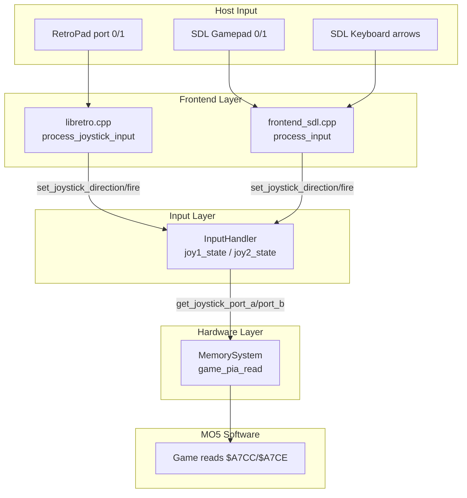

# Design Document: Joystick Emulation

## Overview

This design adds MO5 joystick emulation to the Crayon emulator by wiring the existing Game PIA (`$A7CC–$A7CF`) joystick input pins to actual host controller state. The MO5 supports two joystick ports via the Game PIA: Port A carries 4 direction bits per joystick (active low), and Port B bits 6–7 carry fire buttons (active low). Currently, `game_pia_read` returns hardcoded `0xFF` for Port A and `0xC0` for Port B bits 6–7, meaning no joystick input reaches games.

The change touches three layers:

1. **Input layer** (`InputHandler`): Add `JoystickState` storage for two ports alongside the existing keyboard state.
2. **Hardware layer** (`MemorySystem::game_pia_read`): Replace hardcoded joystick values with live state from `InputHandler`.
3. **Frontend layer** (`libretro.cpp`, `frontend_sdl.cpp`): Map host input (RetroPad / SDL gamepad / keyboard) to `InputHandler` joystick methods each frame.

A port-swap option lets players remap host controller 1 to MO5 joystick port 2 (needed by some games that only read port 2).

### Reference

The MO5 Game PIA bit layout is confirmed by the Theodore emulator (`devices.c`) and DCMOTO documentation:

- **Port A** (`$A7CC`): bits 0–3 = joy1 {up, down, left, right}, bits 4–7 = joy2 {up, down, left, right}. Active low.
- **Port B** (`$A7CE`): bits 0–5 = 6-bit DAC output, bit 6 = joy1 fire, bit 7 = joy2 fire. Active low.

## Architecture



Data flows one way: frontends write joystick state into `InputHandler`; `MemorySystem` reads it when the MO5 CPU accesses the Game PIA. The port-swap logic lives in the frontend layer — it simply swaps which MO5 port index the frontend writes to, so `InputHandler` and `MemorySystem` are swap-unaware.


## Components and Interfaces

### 1. JoystickState Struct (new, in `input_handler.h`)

```cpp
struct JoystickState {
    bool up    = false;
    bool down  = false;
    bool left  = false;
    bool right = false;
    bool fire  = false;
};
```

Plain aggregate — `false` means released, `true` means pressed. The active-low encoding is applied only at the PIA read boundary, not stored here.

### 2. InputHandler Extensions (in `input_handler.h` / `input_handler.cpp`)

New public methods:

```cpp
// Set a single direction or fire for a joystick port (0 or 1)
void set_joystick_direction(int port, bool up, bool down, bool left, bool right);
void set_joystick_fire(int port, bool pressed);

// Read combined Port A byte (bits 0-3 = port1, bits 4-7 = port2, active low)
uint8_t get_joystick_port_a() const;

// Read fire button bits for Port B (bit 6 = port1, bit 7 = port2, active low)
// Returns only bits 6-7; caller merges with DAC bits.
uint8_t get_joystick_port_b_fire() const;

// Clear all joystick state to released
void reset_joystick();
```

New private members:

```cpp
JoystickState joy_[2] = {};  // [0] = port 1, [1] = port 2
```

`reset()` also calls `reset_joystick()`. `get_state()` / `set_state()` are extended to include `JoystickState` in `InputState`.

### 3. InputState Extension (in `input_handler.h`)

```cpp
struct InputState {
    bool keys[MO5_KEY_COUNT] = {};
    JoystickState joy[2] = {};  // NEW
};
```

This extends the existing save-state–serializable struct. Old save states that lack the joystick fields will deserialize with zero-initialized (all released) values, satisfying backward compatibility (Requirement 7.3).

### 4. MemorySystem::game_pia_read Changes (in `memory_system.cpp`)

The `MemorySystem` needs a pointer to `InputHandler` to read joystick state. Add:

```cpp
// In memory_system.h
void set_input_handler(InputHandler* ih);
// Private:
InputHandler* input_handler_ = nullptr;
```

In `game_pia_read`, replace the hardcoded input values:

- **Port A (case 0)**: Replace `0xFF` with `input_handler_->get_joystick_port_a()` for input pins (bits where DDR = 0).
- **Port B (case 2)**: Replace `0xC0` with `input_handler_->get_joystick_port_b_fire()` for input pins (bits 6–7 where DDR = 0). Bits 0–5 remain DAC output feedback.

The DDR masking formula stays the same: `result = (ORA & DDRA) | (input_pins & ~DDRA)`. Only `input_pins` changes from a constant to a live value.

### 5. Libretro Frontend: `process_joystick_input()` (new function in `libretro.cpp`)

Called from `retro_run()` after `process_retropad_input()`. Reads RetroPad D-pad and button B from ports 0 and 1, applies port-swap if enabled, writes to `InputHandler`.

```cpp
static bool g_joystick_port_swap = false;

static void process_joystick_input() {
    auto& input = g_emulator->get_input_handler();
    for (int rp = 0; rp < 2; ++rp) {
        int mo5_port = g_joystick_port_swap ? (1 - rp) : rp;
        bool up    = input_state_cb(rp, RETRO_DEVICE_JOYPAD, 0, RETRO_DEVICE_ID_JOYPAD_UP) != 0;
        bool down  = input_state_cb(rp, RETRO_DEVICE_JOYPAD, 0, RETRO_DEVICE_ID_JOYPAD_DOWN) != 0;
        bool left  = input_state_cb(rp, RETRO_DEVICE_JOYPAD, 0, RETRO_DEVICE_ID_JOYPAD_LEFT) != 0;
        bool right = input_state_cb(rp, RETRO_DEVICE_JOYPAD, 0, RETRO_DEVICE_ID_JOYPAD_RIGHT) != 0;
        bool fire  = input_state_cb(rp, RETRO_DEVICE_JOYPAD, 0, RETRO_DEVICE_ID_JOYPAD_B) != 0;
        input.set_joystick_direction(mo5_port, up, down, left, right);
        input.set_joystick_fire(mo5_port, fire);
    }
}
```

The `crayon_joystick_port_swap` core option is added to `core_options[]` and read in `poll_core_options()`. When the value changes, `input.reset_joystick()` is called before applying the new mapping.

Note: Joystick input is always sampled, even when the VKB is visible (Requirement 3.4). The existing `process_retropad_input` handles VKB navigation on the D-pad, but `process_joystick_input` independently reads the same D-pad for joystick state. This is intentional — the MO5 joystick and keyboard are separate hardware paths.

### 6. SDL Frontend Joystick Mapping (in `frontend_sdl.cpp`)

The SDL frontend maps:
- **SDL gamepad 0** D-pad + button A → MO5 joystick port 1
- **SDL gamepad 1** (if connected) → MO5 joystick port 2
- **Keyboard fallback**: Arrow keys → joy1 directions, Right Ctrl → joy1 fire

When both keyboard and gamepad provide input for the same port, they are OR'd together (either source can activate a direction). The port-swap toggle is exposed via a menu option and a keyboard shortcut (e.g., F9).

### 7. Input Descriptors Update (in `libretro.cpp`)

Add port 1 descriptors for the second RetroPad:

```cpp
{ 1, RETRO_DEVICE_JOYPAD, 0, RETRO_DEVICE_ID_JOYPAD_UP,    "Joy2 Up" },
{ 1, RETRO_DEVICE_JOYPAD, 0, RETRO_DEVICE_ID_JOYPAD_DOWN,  "Joy2 Down" },
{ 1, RETRO_DEVICE_JOYPAD, 0, RETRO_DEVICE_ID_JOYPAD_LEFT,  "Joy2 Left" },
{ 1, RETRO_DEVICE_JOYPAD, 0, RETRO_DEVICE_ID_JOYPAD_RIGHT, "Joy2 Right" },
{ 1, RETRO_DEVICE_JOYPAD, 0, RETRO_DEVICE_ID_JOYPAD_B,     "Joy2 Fire" },
```


## Data Models

### JoystickState

| Field  | Type   | Default | Description                        |
|--------|--------|---------|------------------------------------|
| `up`   | `bool` | `false` | Direction up pressed               |
| `down` | `bool` | `false` | Direction down pressed             |
| `left` | `bool` | `false` | Direction left pressed             |
| `right`| `bool` | `false` | Direction right pressed            |
| `fire` | `bool` | `false` | Fire button pressed                |

### InputState (extended)

| Field  | Type                  | Description                              |
|--------|-----------------------|------------------------------------------|
| `keys` | `bool[58]`            | Existing MO5 keyboard state              |
| `joy`  | `JoystickState[2]`    | NEW: joystick state for ports 1 and 2    |

### Game PIA Register Bit Layout

**Port A (`$A7CC`) — Direction inputs:**

| Bit | Function         | Active Low |
|-----|------------------|------------|
| 0   | Joy1 Up          | 0=pressed  |
| 1   | Joy1 Down        | 0=pressed  |
| 2   | Joy1 Left        | 0=pressed  |
| 3   | Joy1 Right       | 0=pressed  |
| 4   | Joy2 Up          | 0=pressed  |
| 5   | Joy2 Down        | 0=pressed  |
| 6   | Joy2 Left        | 0=pressed  |
| 7   | Joy2 Right       | 0=pressed  |

**Port B (`$A7CE`) — Fire buttons + DAC:**

| Bit   | Function         | Direction |
|-------|------------------|-----------|
| 0–5   | 6-bit DAC output | Output    |
| 6     | Joy1 Fire        | Input (active low) |
| 7     | Joy2 Fire        | Input (active low) |

### Active-Low Encoding

The `get_joystick_port_a()` method converts boolean state to the active-low byte:

```
port_a = 0xFF;  // all released
if (joy_[0].up)    port_a &= ~0x01;
if (joy_[0].down)  port_a &= ~0x02;
if (joy_[0].left)  port_a &= ~0x04;
if (joy_[0].right) port_a &= ~0x08;
if (joy_[1].up)    port_a &= ~0x10;
if (joy_[1].down)  port_a &= ~0x20;
if (joy_[1].left)  port_a &= ~0x40;
if (joy_[1].right) port_a &= ~0x80;
return port_a;
```

Similarly, `get_joystick_port_b_fire()` returns `0xC0` with bits cleared for pressed fire buttons:

```
uint8_t fire_bits = 0xC0;
if (joy_[0].fire) fire_bits &= ~0x40;
if (joy_[1].fire) fire_bits &= ~0x80;
return fire_bits;
```

### Core Option

| Key                          | Description              | Values                    | Default    |
|------------------------------|--------------------------|---------------------------|------------|
| `crayon_joystick_port_swap`  | Swap Joystick Ports      | `disabled` \| `enabled`   | `disabled` |


## Correctness Properties

*A property is a characteristic or behavior that should hold true across all valid executions of a system — essentially, a formal statement about what the system should do. Properties serve as the bridge between human-readable specifications and machine-verifiable correctness guarantees.*

### Property 1: Joystick state round-trip

*For any* joystick port (0 or 1) and *for any* combination of direction booleans (up, down, left, right) and fire boolean, setting those values via `set_joystick_direction` and `set_joystick_fire` then reading them back via the `JoystickState` should return the same boolean values.

**Validates: Requirements 1.2**

### Property 2: Port A active-low encoding

*For any* two `JoystickState` values (one per port), each with 4 direction booleans, the byte returned by `get_joystick_port_a()` should have bit N cleared (0) if and only if the corresponding direction is pressed (`true`), where bits 0–3 map to port 1 {up, down, left, right} and bits 4–7 map to port 2 {up, down, left, right}.

**Validates: Requirements 1.3, 2.4**

### Property 3: Port B fire active-low encoding

*For any* combination of two fire button booleans (port 1 and port 2), the byte returned by `get_joystick_port_b_fire()` should have bit 6 cleared if and only if port 1 fire is pressed, and bit 7 cleared if and only if port 2 fire is pressed, with bits 0–5 always zero.

**Validates: Requirements 1.4, 2.4**

### Property 4: Reset clears all joystick state

*For any* joystick state (arbitrary directions and fire for both ports) set before calling `reset()`, after reset all directions and fire buttons for both ports should be `false`, and `get_joystick_port_a()` should return `0xFF` and `get_joystick_port_b_fire()` should return `0xC0`.

**Validates: Requirements 1.5**

### Property 5: Game PIA Port A DDR masking with joystick input

*For any* DDR value, *for any* output register value written to Port A, and *for any* joystick direction state, reading Game PIA Port A should return `(ORA & DDRA) | (joystick_port_a & ~DDRA)`, where `joystick_port_a` is the active-low encoded direction byte from `InputHandler`.

**Validates: Requirements 2.1, 2.3**

### Property 6: Game PIA Port B preserves DAC bits and reads fire inputs

*For any* DDR value, *for any* DAC value (6-bit, 0–63) written to Port B bits 0–5, and *for any* joystick fire button state, reading Game PIA Port B should return `(ORB & DDRB) | (input_pins & ~DDRB)` where `input_pins` has bits 0–5 = 0 (DAC feedback) and bits 6–7 from `get_joystick_port_b_fire()`.

**Validates: Requirements 2.2, 6.2, 6.3**

### Property 7: DAC write path unchanged by joystick emulation

*For any* value written to Game PIA Port B when CRB bit 2 is set (data mode), the AudioSystem DAC should receive `(value & 0x3F)` scaled to the int16 range, regardless of the current joystick fire button state.

**Validates: Requirements 6.1**

### Property 8: RetroPad to MO5 joystick mapping

*For any* RetroPad D-pad and button B state on ports 0 and 1, with port swap disabled, `InputHandler` joystick port 0 should match RetroPad port 0 state and joystick port 1 should match RetroPad port 1 state.

**Validates: Requirements 3.1, 3.2, 3.3**

### Property 9: Port swap inverts routing

*For any* RetroPad D-pad and button B state on ports 0 and 1, with port swap enabled, `InputHandler` joystick port 0 should match RetroPad port 1 state and joystick port 1 should match RetroPad port 0 state.

**Validates: Requirements 5.2, 5.3**

### Property 10: Port swap toggle clears joystick state

*For any* joystick state set before toggling the port swap setting, immediately after the toggle all joystick directions and fire buttons for both ports should be in the released state.

**Validates: Requirements 5.5**

### Property 11: SDL input OR-combination

*For any* keyboard arrow/fire state and *for any* SDL gamepad D-pad/button state targeting the same MO5 joystick port, the resulting joystick direction/fire for that port should be the logical OR of both sources (a direction is pressed if either source reports it pressed).

**Validates: Requirements 4.4**

### Property 12: Save state joystick round-trip

*For any* `InputState` containing arbitrary keyboard and joystick state for both ports, serializing to a save state buffer and deserializing should produce an `InputState` with identical joystick state.

**Validates: Requirements 7.1, 7.2**


## Error Handling

### Invalid Port Index

`set_joystick_direction` and `set_joystick_fire` accept a port index (0 or 1). If an out-of-range index is passed, the methods silently ignore the call (no crash, no state change). This mirrors the existing `set_key_state` behavior which bounds-checks the scancode.

### Null InputHandler Pointer

`MemorySystem::game_pia_read` must handle the case where `input_handler_` is null (e.g., during early initialization before wiring). When null, fall back to the current hardcoded behavior: Port A returns `0xFF`, Port B bits 6–7 return `0xC0`. This ensures backward compatibility if `set_input_handler` is never called.

### Missing Second Gamepad (SDL)

If only one SDL gamepad is connected, joystick port 2 receives no gamepad input (stays released). The keyboard fallback only applies to port 1. This is not an error — it's normal single-player operation.

### Save State Version Mismatch

Old save states (version < 2) lack `JoystickState` in `InputState`. The deserializer zero-initializes the `joy[2]` array, which means all-released. No error is raised — this is handled by the default initialization of the `JoystickState` struct.

## Testing Strategy

### Unit Tests

Unit tests cover specific examples and edge cases:

- **InputHandler construction**: Verify both joystick ports initialize to all-released.
- **Port A encoding spot checks**: Set specific direction combinations, verify exact byte values (e.g., joy1 up+left pressed → `0xFA`).
- **Port B fire spot checks**: Set specific fire combinations, verify exact byte values.
- **Reset behavior**: Set arbitrary state, call reset, verify all-released.
- **Old save state backward compatibility** (edge case): Deserialize a save state buffer that lacks joystick fields, verify joystick state is all-released.
- **Null InputHandler in MemorySystem**: Read Game PIA without calling `set_input_handler`, verify hardcoded fallback values.
- **DDR edge cases**: Set DDR to all-output (0xFF), verify Port A reads back ORA regardless of joystick state. Set DDR to all-input (0x00), verify Port A reads joystick state regardless of ORA.

### Property-Based Tests

Property-based tests use a PBT library (e.g., [RapidCheck](https://github.com/emil-e/rapidcheck) for C++) with a minimum of 100 iterations per property. Each test references its design property.

- **Property 1** (joystick state round-trip): Generate random port index, random direction/fire booleans. Set then read back.
  - Tag: `Feature: joystick-emulation, Property 1: Joystick state round-trip`

- **Property 2** (Port A active-low encoding): Generate random 8-bit direction state (4 bools × 2 ports). Verify byte matches active-low formula.
  - Tag: `Feature: joystick-emulation, Property 2: Port A active-low encoding`

- **Property 3** (Port B fire active-low encoding): Generate random 2-bit fire state. Verify byte matches formula.
  - Tag: `Feature: joystick-emulation, Property 3: Port B fire active-low encoding`

- **Property 4** (reset clears state): Generate random full joystick state, set it, reset, verify all-released.
  - Tag: `Feature: joystick-emulation, Property 4: Reset clears all joystick state`

- **Property 5** (DDR masking Port A): Generate random DDR, ORA, and joystick state. Verify read formula.
  - Tag: `Feature: joystick-emulation, Property 5: Game PIA Port A DDR masking with joystick input`

- **Property 6** (Port B DAC + fire): Generate random DDR, ORB (DAC value), and fire state. Verify read formula.
  - Tag: `Feature: joystick-emulation, Property 6: Game PIA Port B preserves DAC bits and reads fire inputs`

- **Property 7** (DAC write path): Generate random Port B write value and fire state. Verify AudioSystem receives correct DAC sample.
  - Tag: `Feature: joystick-emulation, Property 7: DAC write path unchanged by joystick emulation`

- **Property 8** (RetroPad mapping): Generate random D-pad/fire state for two RetroPad ports. Mock `input_state_cb`, call `process_joystick_input`, verify InputHandler state.
  - Tag: `Feature: joystick-emulation, Property 8: RetroPad to MO5 joystick mapping`

- **Property 9** (port swap routing): Same as Property 8 but with swap enabled. Verify ports are inverted.
  - Tag: `Feature: joystick-emulation, Property 9: Port swap inverts routing`

- **Property 10** (swap toggle clears): Generate random joystick state, toggle swap, verify all-released.
  - Tag: `Feature: joystick-emulation, Property 10: Port swap toggle clears joystick state`

- **Property 11** (SDL OR-combination): Generate random keyboard and gamepad states for same port. Verify OR combination.
  - Tag: `Feature: joystick-emulation, Property 11: SDL input OR-combination`

- **Property 12** (save state round-trip): Generate random InputState with joystick data. Serialize, deserialize, compare.
  - Tag: `Feature: joystick-emulation, Property 12: Save state joystick round-trip`

### Test Organization

- Properties 1–4 test the `InputHandler` in isolation (no mocking needed).
- Properties 5–7 test `MemorySystem::game_pia_read/write` with a real `InputHandler` (lightweight integration).
- Properties 8–10 test the libretro frontend mapping (requires mocking `input_state_cb`).
- Property 11 tests the SDL frontend input combination (requires SDL event mocking or abstraction).
- Property 12 tests the save state serialization path.

Each property-based test must run at least 100 iterations. The PBT library should be RapidCheck (already available via the ext/googletest infrastructure) or an equivalent C++ PBT framework.
