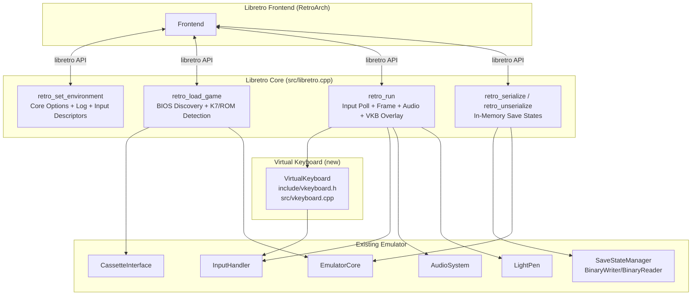

# Design Document: Libretro Integration

## Overview

This design brings the Crayon MO5 libretro core from its current minimal state (~150 lines handling basic frame rendering and cartridge loading) to production quality. The key additions are:

1. A virtual keyboard (VKB) overlay for gamepad-only users — critical because MO5 cassette games require typing `LOAD""` + `RUN`
2. Complete input handling: RetroPad mapping, physical keyboard pass-through, and light pen pointer mapping
3. K7 cassette file detection and loading (currently only cartridge ROMs are supported)
4. Core options for cassette speed, VKB transparency, and VKB position
5. BIOS auto-discovery with multiple filename fallbacks and subdirectory search
6. Proper mono→stereo audio conversion with silence padding
7. In-memory save state serialization (replacing the current temp-file hack)
8. Input descriptors and structured error logging

The design follows the Videopac libretro core as a reference architecture, adapted for the MO5's scancode-based keyboard (not matrix), AZERTY layout, and light pen hardware.

## Architecture

The libretro core is a single compilation unit (`src/libretro.cpp`) plus two new files for the virtual keyboard (`include/vkeyboard.h`, `src/vkeyboard.cpp`). All other functionality lives in the existing emulator components accessed through `EmulatorCore`.



### Data Flow per Frame (`retro_run`)

1. Poll input via `input_poll_cb()`
2. Check `RETRO_ENVIRONMENT_GET_VARIABLE_UPDATE` — apply changed core options
3. Read RetroPad state → map to MO5 keys (or route to VKB navigation if VKB visible)
4. Read keyboard state → map RETROK_* to MO5Key via AZERTY table
5. Read pointer state → convert to MO5 screen coords → update LightPen
6. Call `emulator->run_frame()`
7. Get framebuffer; if VKB visible, composite VKB overlay onto framebuffer copy
8. Submit video via `video_cb()`
9. Get mono audio from AudioSystem → convert to stereo interleaved → submit via `audio_batch_cb()`

## Components and Interfaces

### 1. VirtualKeyboard (new: `include/vkeyboard.h`, `src/vkeyboard.cpp`)

```cpp
namespace crayon {

enum class VKBPosition { Bottom, Top };
enum class VKBTransparency { Opaque, SemiTransparent, Transparent };

struct VKBKey {
    MO5Key mo5_key;
    const char* label;      // Display label (e.g., "A", "SHIFT", "ENT")
    uint8_t row, col;       // Grid position
    uint8_t width;          // Width in grid units (1 = normal, 2 = wide keys like SPACE)
};

class VirtualKeyboard {
public:
    VirtualKeyboard();

    void toggle_visible();
    bool is_visible() const;

    // Navigation
    void move_cursor(int dx, int dy);  // D-pad input
    void press_selected();              // Returns MO5Key press+release to caller
    void toggle_shift();
    void toggle_position();

    // Configuration
    void set_position(VKBPosition pos);
    void set_transparency(VKBTransparency t);
    VKBPosition get_position() const;

    // Rendering — composites onto existing framebuffer
    void render(uint32* framebuffer, int fb_width, int fb_height);

    // Query
    MO5Key get_selected_key() const;
    bool is_shift_active() const;

private:
    bool visible_ = false;
    bool shift_active_ = false;
    int cursor_row_ = 0;
    int cursor_col_ = 0;
    VKBPosition position_ = VKBPosition::Bottom;
    VKBTransparency transparency_ = VKBTransparency::Opaque;

    static const VKBKey LAYOUT[];       // 58-key MO5 AZERTY layout
    static const int ROW_COUNT;
    static const int MAX_COL_COUNT;

    int get_key_index(int row, int col) const;
    void clamp_cursor();
    uint32_t blend_pixel(uint32_t bg, uint32_t fg, uint8_t alpha) const;
};

} // namespace crayon
```

The VKB layout is a static array of `VKBKey` entries arranged in rows matching the physical MO5 keyboard. The `render()` method draws directly into the XRGB8888 framebuffer using simple filled rectangles with text labels — no texture atlas needed. Alpha blending is done per-pixel based on the transparency setting.

### 2. Libretro Core Enhancements (`src/libretro.cpp`)

New static state added to the compilation unit:

```cpp
static VirtualKeyboard g_vkb;
static bool g_select_prev = false;     // Edge detection for SELECT toggle
static int16_t g_stereo_buf[960 * 2];  // 960 stereo frames per PAL frame
```

Key function changes:

- `retro_set_environment()`: Register core options via `RETRO_ENVIRONMENT_SET_VARIABLES`, set input descriptors
- `retro_load_game()`: BIOS auto-discovery with fallback filenames, K7 vs ROM detection by extension, header sniffing for unknown extensions
- `retro_run()`: Full input pipeline (RetroPad → VKB or MO5 keys, keyboard pass-through, pointer → light pen), core option polling, VKB overlay compositing, mono→stereo audio conversion
- `retro_serialize()` / `retro_unserialize()`: In-memory serialization using existing `BinaryWriter`/`BinaryReader`
- `retro_serialize_size()`: Dynamic size calculation based on current `SaveState`

### 3. Libretro Header Extensions (`include/libretro.h`)

The header needs additional constants for pointer device and keyboard keys:

```cpp
#define RETRO_DEVICE_POINTER  6

#define RETRO_DEVICE_ID_POINTER_X       0
#define RETRO_DEVICE_ID_POINTER_Y       1
#define RETRO_DEVICE_ID_POINTER_PRESSED 2

// Keyboard key IDs (subset needed for MO5 mapping)
enum retro_key {
    RETROK_UNKNOWN = 0,
    RETROK_RETURN = 13, RETROK_ESCAPE = 27, RETROK_SPACE = 32,
    // ... numeric, alpha, function keys, modifiers
    RETROK_LSHIFT = 304, RETROK_RSHIFT = 303,
    RETROK_LCTRL = 306,
    // Full set as per libretro spec
};
```

### 4. In-Memory Serialization

The existing `BinaryWriter` writes to `std::vector<uint8_t>` and `BinaryReader` reads from one. The current `retro_serialize`/`retro_unserialize` use a temp file as an intermediary — this is replaced by:

1. Collecting a `SaveState` struct from `EmulatorCore` components
2. Writing it to a `BinaryWriter` (in-memory vector)
3. Copying the vector contents into the libretro-provided buffer

For deserialization, the reverse: wrap the libretro buffer in a `BinaryReader`, read the `SaveState`, and apply it to components.

This requires exposing the write/read functions from `savestate.cpp` (currently file-static) or adding new `SaveStateManager` methods that work with buffers instead of file paths.

### 5. BIOS Auto-Discovery

```
Search order for BASIC ROM:
  1. {system_dir}/basic5.rom
  2. {system_dir}/mo5_basic.rom
  3. {system_dir}/mo5.bas
  4. {system_dir}/crayon/basic5.rom
  5. {system_dir}/crayon/mo5_basic.rom
  6. {system_dir}/crayon/mo5.bas

Search order for Monitor ROM:
  1. {system_dir}/mo5.rom
  2. {system_dir}/mo5_monitor.rom
  3. {system_dir}/mo5.mon
  4. {system_dir}/crayon/mo5.rom
  5. {system_dir}/crayon/mo5_monitor.rom
  6. {system_dir}/crayon/mo5.mon
```

### 6. RETROK → MO5Key Mapping Table

A static lookup table in `libretro.cpp` maps `retro_key` values to `MO5Key` scancodes, following the AZERTY layout. This is similar to `char_mapping.h` but operates on libretro key codes rather than ASCII characters. Modifier keys (LSHIFT→SHIFT, RSHIFT→BASIC, LCTRL→CNT) are mapped directly.

### 7. K7 vs Cartridge Detection

```
Extension-based routing in retro_load_game:
  .k7           → cassette_.load_k7() + play_cassette()
  .rom/.bin/.mo5 → load_cartridge()
  other         → inspect first bytes for K7 magic header (0x01 block type),
                  fall back to cartridge, log warning
```

## Data Models

### VKB Layout Data

The 58-key layout is stored as a compile-time array. Each entry maps a grid position to an `MO5Key` and display label. The layout mirrors the physical MO5 keyboard:

```
Row 0: STOP  1  2  3  4  5  6  7  8  9  0  +  ACC  ACC2  EFF
Row 1: CNT   A  Z  E  R  T  Y  U  I  O  P  *  ENT
Row 2: SHIFT Q  S  D  F  G  H  J  K  L  M  @
Row 3: BASIC W  X  C  V  B  N  ,  .  /  ←  →  ↑  ↓
Row 4:                    SPACE
```

Note: Labels use AZERTY positions (A is where Q is on QWERTY, etc.). The `MO5Key` enum values are already correct for this layout.

### Core Options

```cpp
static const struct retro_variable core_options[] = {
    { "crayon_cassette_mode", "Cassette Load Mode; Fast|Slow (Real-time)" },
    { "crayon_vkb_transparency", "Virtual Keyboard Transparency; Opaque|Semi-Transparent|Transparent" },
    { "crayon_vkb_position", "Virtual Keyboard Position; Bottom|Top" },
    { NULL, NULL }
};
```

### Stereo Audio Buffer

Per-frame buffer: `int16_t stereo_buf[960 * 2]` where index `i*2` = left channel, `i*2+1` = right channel. Both channels get the same mono sample value. If the AudioSystem ring buffer has fewer than 960 samples, remaining frames are zero-filled.

### Input Descriptors

```cpp
static const struct retro_input_descriptor input_descriptors[] = {
    { 0, RETRO_DEVICE_JOYPAD, 0, RETRO_DEVICE_ID_JOYPAD_UP,     "Up" },
    { 0, RETRO_DEVICE_JOYPAD, 0, RETRO_DEVICE_ID_JOYPAD_DOWN,   "Down" },
    { 0, RETRO_DEVICE_JOYPAD, 0, RETRO_DEVICE_ID_JOYPAD_LEFT,   "Left" },
    { 0, RETRO_DEVICE_JOYPAD, 0, RETRO_DEVICE_ID_JOYPAD_RIGHT,  "Right" },
    { 0, RETRO_DEVICE_JOYPAD, 0, RETRO_DEVICE_ID_JOYPAD_B,      "Action / VKB Press" },
    { 0, RETRO_DEVICE_JOYPAD, 0, RETRO_DEVICE_ID_JOYPAD_A,      "Enter / VKB Shift" },
    { 0, RETRO_DEVICE_JOYPAD, 0, RETRO_DEVICE_ID_JOYPAD_Y,      "VKB Move Position" },
    { 0, RETRO_DEVICE_JOYPAD, 0, RETRO_DEVICE_ID_JOYPAD_SELECT, "Toggle Virtual Keyboard" },
    { 0, RETRO_DEVICE_JOYPAD, 0, RETRO_DEVICE_ID_JOYPAD_START,  "STOP" },
    { 0, 0, 0, 0, NULL }
};
```

### Save State Size Calculation

The `retro_serialize_size()` return value must account for variable-length cassette data. Calculation:

```
Fixed components:
  CPU6809State:    ~20 bytes
  GateArrayState:  ~16 bytes
  MO5MemoryState:  ~48KB (16KB VRAM + 32KB RAM + flags)
  PIAState:        ~16 bytes
  AudioState:      ~12 bytes
  InputState:      58 bytes
  LightPenState:   ~8 bytes
  frame_count:     8 bytes
  version:         4 bytes
  checksum:        4 bytes

Variable:
  CassetteState:   k7_data vector (up to ~256KB for large tapes)
                   + record_buffer + position fields

Conservative upper bound: 512KB (524288 bytes)
```

The size is computed once at `retro_load_game` time and cached, since the K7 data size is fixed after loading.


## Correctness Properties

*A property is a characteristic or behavior that should hold true across all valid executions of a system — essentially, a formal statement about what the system should do. Properties serve as the bridge between human-readable specifications and machine-verifiable correctness guarantees.*

### Property 1: VKB toggle round-trip

*For any* VirtualKeyboard state (visible/hidden, position top/bottom, shift on/off), applying the corresponding toggle operation twice SHALL produce a state identical to the original.

**Validates: Requirements 1.1, 1.5, 1.6**

### Property 2: VKB cursor navigation stays in bounds

*For any* valid cursor position in the VKB grid and *for any* D-pad direction (up, down, left, right), after moving the cursor, the resulting position SHALL be within the valid grid bounds (0 ≤ row < ROW_COUNT, 0 ≤ col < row's column count).

**Validates: Requirements 1.3**

### Property 3: VKB selected key matches layout

*For any* valid cursor position (row, col) in the VKB grid, the MO5Key returned by `get_selected_key()` SHALL equal the MO5Key defined in the LAYOUT array at that position.

**Validates: Requirements 1.4**

### Property 4: Keyboard press/release round-trip

*For any* retro_key that has a mapping in the AZERTY table, pressing the key (setting it in InputHandler) and then releasing it SHALL return the corresponding MO5Key to the unpressed state in the InputHandler.

**Validates: Requirements 3.1, 3.2**

### Property 5: File extension routes to correct subsystem

*For any* file path with a `.k7` extension, the content SHALL be routed to the CassetteInterface. *For any* file path with a `.rom`, `.bin`, or `.mo5` extension, the content SHALL be routed to the cartridge loader.

**Validates: Requirements 4.1, 4.2**

### Property 6: BIOS discovery finds ROM under any accepted filename

*For any* BIOS ROM (BASIC or monitor) placed under any of the accepted filenames in either the system directory root or the `crayon` subdirectory, the BIOS discovery function SHALL locate and return the path to that file.

**Validates: Requirements 6.1, 6.2, 6.4**

### Property 7: Mono-to-stereo conversion preserves samples

*For any* mono audio buffer of N samples (0 ≤ N ≤ 960), the stereo conversion SHALL produce exactly 960 stereo frames where: for each index i < N, `stereo[i*2] == stereo[i*2+1] == mono[i]`, and for each index i ≥ N, `stereo[i*2] == stereo[i*2+1] == 0`.

**Validates: Requirements 7.1, 7.2, 7.3, 7.4**

### Property 8: Serialize size is sufficient

*For any* valid emulator state (including variable-length cassette data), the value returned by `retro_serialize_size()` SHALL be greater than or equal to the actual number of bytes produced by serializing that state.

**Validates: Requirements 8.3**

### Property 9: Save state serialization round-trip

*For any* valid `SaveState` struct, serializing it to a byte buffer via `BinaryWriter` and then deserializing it back via `BinaryReader` SHALL produce a `SaveState` equivalent to the original.

**Validates: Requirements 8.4**

### Property 10: Pointer-to-MO5 coordinate mapping is within display bounds

*For any* libretro pointer coordinate pair (x, y) in the range [-32768, 32767], the converted MO5 screen coordinates SHALL be clamped to [0, 319] horizontal and [0, 199] vertical.

**Validates: Requirements 9.1, 9.2**

## Error Handling

### BIOS Not Found

When BIOS auto-discovery fails (no file found under any accepted name in any searched directory):
- Log an error-level message listing all searched filenames and paths
- Return `false` from `retro_load_game()` — the frontend will display a failure message
- Do not crash or leave the emulator in a partial state

### Content Load Failure

When K7 parsing or cartridge loading fails (corrupt data, wrong format):
- Log an error-level message with the specific failure reason from the `Result::error` string
- For K7: do not call `play_cassette()`, leave cassette in idle state
- For cartridge: return `false` from `retro_load_game()`
- For unknown extensions with failed header detection: log a warning, attempt cartridge load as fallback

### Audio Buffer Underrun

When `AudioSystem::samples_available()` returns fewer than 960 samples:
- Read all available samples
- Zero-fill the remaining stereo frames
- Do not log (this is normal during startup or pause transitions)

### Save State Errors

When serialization fails (buffer too small, corrupt data during deserialization):
- `retro_serialize()` returns `false` — frontend handles the error
- `retro_unserialize()` returns `false` — emulator state remains unchanged (the current state is not corrupted)
- Log error-level message with failure reason

### Null Log Callback

All logging calls are guarded by `if (log_cb)` check. If the frontend does not provide a log interface, all logging is silently skipped.

### Core Option Defaults

If `RETRO_ENVIRONMENT_GET_VARIABLE` returns null or an unrecognized value for any option, the core uses the default value (first value in the option string). No error is logged for this case — it's normal during first run.

## Testing Strategy

### Property-Based Testing

Use [rapidcheck](https://github.com/emil-e/rapidcheck) as the property-based testing library (C++ PBT library, integrates with Catch2/Google Test). Each property test runs a minimum of 100 iterations with randomly generated inputs.

Each property-based test MUST be tagged with a comment referencing the design property:
```cpp
// Feature: libretro-integration, Property 1: VKB toggle round-trip
```

Property tests to implement (one test per property):

1. **VKB toggle round-trip** — Generate random initial VKB states, apply toggle twice, assert equality
2. **VKB cursor navigation bounds** — Generate random (row, col) positions and directions, assert post-move position is in bounds
3. **VKB selected key matches layout** — Generate random valid (row, col), assert `get_selected_key()` matches LAYOUT
4. **Keyboard press/release round-trip** — Generate random mapped retro_keys, press then release, assert MO5Key returns to unpressed
5. **File extension routing** — Generate random filenames with known extensions, assert correct routing
6. **BIOS discovery** — Generate random placements of ROM files under accepted names in temp directories, assert discovery succeeds
7. **Mono-to-stereo conversion** — Generate random mono buffers of length 0–960, assert stereo output matches specification
8. **Serialize size sufficiency** — Generate random SaveState structs with varying cassette data sizes, assert serialize_size >= actual size
9. **Save state round-trip** — Generate random SaveState structs, serialize then deserialize, assert equality
10. **Pointer coordinate mapping** — Generate random pointer (x, y) in [-32768, 32767], assert MO5 coordinates are in [0,319]×[0,199]

### Unit Tests

Unit tests complement property tests by covering specific examples, edge cases, and integration points:

- **VKB layout completeness**: Verify all 58 MO5Key values appear in the VKB LAYOUT array (Req 1.8)
- **VKB transparency levels**: Set each of the 3 transparency values, verify stored correctly (Req 1.7)
- **RetroPad mapping specifics**: Verify D-pad→arrow keys, B→SPACE, A→ENTER, Start→STOP (Req 2.1–2.4)
- **Shift key mapping**: Verify RETROK_LSHIFT→MO5Key::SHIFT, RETROK_RSHIFT→MO5Key::BASIC (Req 3.3)
- **K7 auto-play**: After loading a K7 file, verify `cassette.is_playing() == true` (Req 4.3)
- **Unknown extension header detection**: Load data with unknown extension but valid K7 header, verify correct routing (Req 4.4)
- **Core options array**: Verify all 3 options are present with correct keys and values (Req 5.1–5.3)
- **BIOS not found error**: With empty system directory, verify `retro_load_game` returns false and logs error (Req 6.3)
- **Input descriptors**: Verify descriptor array contains entries for all mapped buttons (Req 2.5)
- **Log callback null safety**: With null log_cb, call all logging paths, verify no crash (Req 10.5)
- **Option change logging**: Apply an option change, verify info-level log is emitted (Req 10.4)
- **BIOS/content error logging**: Trigger load failures, verify error-level logs (Req 10.2, 10.3)
