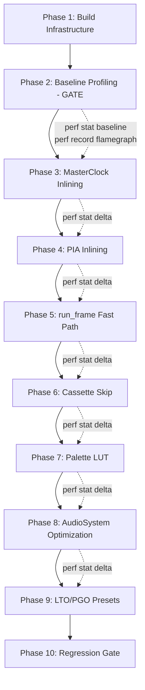
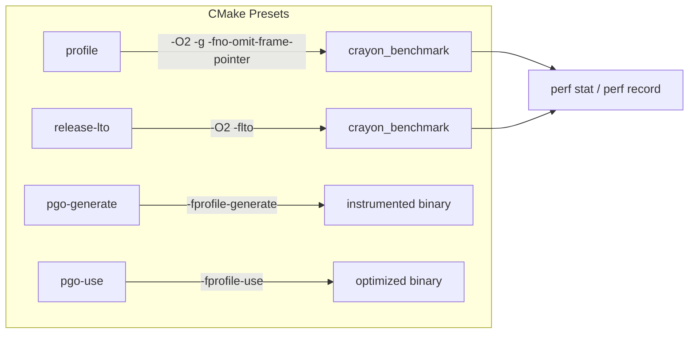

# Design Document: Libretro Performance Optimization

## Overview

This design describes a profiling-first performance optimization campaign for the Crayon MO5 libretro core. The methodology is strict: no code changes before baseline profiling. Every optimization is measured in isolation with `perf stat` cycle counts, and reverted if it shows less than 1% improvement.

The MO5 runs at 50 Hz PAL with a 1 MHz CPU (20,000 cycles/frame). The hot path is `EmulatorCore::run_frame()`, which executes ~4,000 CPU instructions per frame. Each instruction triggers:
- `MasterClock::tick()` called N times (N = instruction cycle count, total ~20K/frame)
- `AudioSystem::tick(cycles)` called once per instruction (~4K/frame)
- `CassetteInterface::update_cycle()` called once per instruction (~4K/frame)
- `PIA::irq_active()` + `PIA::firq_active()` via `handle_interrupts()` (~4K/frame)

Outside the hot loop, `GateArray::render_frame()` runs once per frame (bitmap renderer), and the libretro frontend converts 64,000 pixels from RGBA to XRGB8888.

The optimization targets are:
1. **Build infrastructure** — benchmark target in CMake, profile/LTO/PGO presets
2. **Baseline profiling** — `perf stat` + `perf record` flame graph before any changes
3. **Cross-TU inlining** — move trivial MasterClock/PIA methods to headers
4. **run_frame() fast path** — skip cassette checks when no cassette is loaded
5. **Cassette update skip** — skip `update_cycle()` when not playing/recording
6. **Palette LUT** — eliminate per-pixel RGBA→XRGB conversion in libretro
7. **AudioSystem tick optimization** — inline or batch the trivial tick()
8. **LTO/PGO presets** — compiler-level cross-TU optimization

## Architecture

The optimization campaign follows a strict sequential pipeline. Each phase gates the next.



### Profiling-First Enforcement

The baseline profiling phase (Phase 2) is a hard gate. The `perf-baseline.md` document must exist with cycle counts and flame graph data before any optimization code is written. Each subsequent optimization:
1. Captures `perf stat` before the change
2. Applies the change as an isolated commit
3. Captures `perf stat` after the change
4. Computes percentage cycle reduction
5. Reverts if < 1% improvement

### Build Configuration Architecture



## Components and Interfaces

### 1. CMake Build System Changes

**File: `CMakeLists.txt`**

Add `crayon_benchmark` as a build target:
```cmake
add_executable(crayon_benchmark tools/crayon_benchmark.cpp)
target_link_libraries(crayon_benchmark crayon_core)
```

This is gated behind `BUILD_TESTS` since the benchmark tool already exists in `tools/` but is not wired into the build.

**File: `CMakePresets.json`**

Add four new presets inheriting from `ci-std` and `cmake-pedantic`:

| Preset | Flags | Purpose |
|--------|-------|---------|
| `profile` | `-O2 -g -fno-omit-frame-pointer` | Accurate `perf record` stack sampling |
| `release-lto` | `-O2 -flto` | Link-time optimization measurement |
| `pgo-generate` | `-O2 -fprofile-generate` | Instrumented binary for PGO training |
| `pgo-use` | `-O2 -fprofile-use=<dir>` | Apply profile-guided optimizations |

All presets use Ninja generator and output to `build/<preset-name>`.

### 2. MasterClock Inlining

**Current state:** All methods in `src/master_clock.cpp`. The `tick()` method is 10 lines with 3 increments and 2 branch checks. Called 20,000 times per frame from `run_frame()` — each call crosses a translation unit boundary.

**Change:** Move the bodies of these methods from `master_clock.cpp` to `master_clock.h` as `inline` definitions:
- `tick()` — the hot one (20K calls/frame)
- `frame_complete()` — called in the while-loop condition (20K calls/frame)
- `clear_frame_complete()` — called once/frame
- `get_cycle_count()` — called once per instruction (~4K/frame)
- `get_current_scanline()` / `get_scanline_cycle()` — accessors

The `reset()` method and constructor stay in the `.cpp` file (called rarely).

**Interface:** No API changes. The class interface in `master_clock.h` remains identical; only the method bodies move from `.cpp` to `.h`.

### 3. PIA Interrupt Check Inlining

**Current state:** `irq_active()` and `firq_active()` are in `src/pia.cpp`. Each is a simple boolean expression checking 2 flags and 2 control register bits. Called ~4,000 times/frame from `handle_interrupts()`.

**Change:** Move `irq_active()` and `firq_active()` bodies to `pia.h` as `inline` definitions.

```cpp
// In pia.h
inline bool PIA::irq_active() const {
    return (state_.irqa1_flag && (state_.cra & 0x01)) ||
           (state_.irqa2_flag && (state_.cra & 0x08));
}

inline bool PIA::firq_active() const {
    return (state_.irqb1_flag && (state_.crb & 0x01)) ||
           (state_.irqb2_flag && (state_.crb & 0x08));
}
```

**Interface:** No API changes.

### 4. run_frame() Fast Path

**Current state:** The inner loop in `run_frame()` always checks `cassette_.get_load_mode() == CassetteLoadMode::Fast` and then `cpu_.get_pc()` on every iteration, even when no cassette is loaded. This adds two branches per iteration (~20K branch checks per frame for the outer cassette mode check).

**Change:** Split the while loop into two paths selected before the loop:

```cpp
void EmulatorCore::run_frame() {
    if (!running_ || paused_) return;
    master_clock_.clear_frame_complete();

    const bool fast_cassette = (cassette_.get_load_mode() == CassetteLoadMode::Fast);

    while (!master_clock_.frame_complete()) {
        if (fast_cassette) {
            // ... existing cassette intercept logic for $F10B and $F181 ...
        }

        uint8_t cycles = cpu_.execute_instruction();
        for (uint8_t i = 0; i < cycles; ++i)
            master_clock_.tick();

        audio_.tick(cycles);
        cassette_.update_cycle(master_clock_.get_cycle_count());
        handle_interrupts();
    }
    // ... rest unchanged ...
}
```

The key insight: `cassette_.get_load_mode()` doesn't change during a frame, so we hoist it out of the loop. The compiler may already do this, but making it explicit ensures it. The bigger win is that when `fast_cassette` is false (the common case — no cassette or slow mode), the entire cassette intercept block is skipped without evaluating `cpu_.get_pc()`.

### 5. CassetteInterface::update_cycle() Skip

**Current state:** `update_cycle()` is called every instruction (~4K/frame). Its body is just `state_.current_cycle = cycle;` — a single assignment. But the function call overhead (cross-TU call, parameter passing) adds up.

**Change:** Guard the call in `run_frame()`:

```cpp
const bool cassette_active = cassette_.is_playing() || cassette_.is_recording();
// ... in the loop:
if (cassette_active)
    cassette_.update_cycle(master_clock_.get_cycle_count());
```

The `is_playing()` / `is_recording()` state doesn't change during a frame (only user actions change it between frames), so the check is hoisted.

### 6. Palette LUT for Libretro

**Current state:** `GateArray::render_frame()` writes RGBA values from `MO5_PALETTE_RGBA[16]` to the framebuffer. Then `retro_run()` in `libretro.cpp` converts all 64,000 pixels via `rgba_to_xrgb()` (bit-shifting per pixel).

**Design choice:** Add a `constexpr` XRGB palette and a render mode flag to GateArray.

**New constant in `types.h`:**
```cpp
constexpr uint32 MO5_PALETTE_XRGB8888[16] = {
    0x00000000,  //  0: black
    0x00FF0000,  //  1: red
    0x0000FF00,  //  2: green
    0x00FFFF00,  //  3: yellow
    0x000000FF,  //  4: blue
    0x00FF00FF,  //  5: magenta
    0x0000FFFF,  //  6: cyan
    0x00FFFFFF,  //  7: white
    0x00808080,  //  8: grey
    0x00FF8080,  //  9: light red (pink)
    0x0080FF80,  // 10: light green
    0x00FFFF80,  // 11: light yellow
    0x008080FF,  // 12: light blue
    0x00FF80FF,  // 13: light magenta
    0x0080FFFF,  // 14: light cyan
    0x00FF8000   // 15: orange
};
```

**GateArray changes:**
- Add `void set_palette_mode(bool xrgb8888)` to select which palette to use
- `render_frame()` selects `MO5_PALETTE_XRGB8888` or `MO5_PALETTE_RGBA` based on the mode flag
- Default mode remains RGBA (no regression to SDL frontend)

**Libretro changes:**
- Call `gate_array.set_palette_mode(true)` during `retro_load_game()`
- In `retro_run()`, copy framebuffer directly to `g_vkb_framebuffer` without `rgba_to_xrgb()` conversion (just `memcpy` for the non-VKB path)

This eliminates 64,000 bit-shift operations per frame.

### 7. AudioSystem::tick() Optimization

**Current state:** `tick()` is called once per instruction (~4K/frame). The body is:
```cpp
void AudioSystem::tick(int cpu_cycles) {
    cycle_counter_ += cpu_cycles;
    cycles_since_toggle_ += cpu_cycles;
}
```

Two integer additions. The function call overhead (cross-TU) likely dominates the actual work.

**Change:** Move `tick()` to `audio_system.h` as an inline definition. This is the simplest approach and matches the MasterClock/PIA pattern.

### 8. Benchmark Regression Gate

**Current state:** `crayon_benchmark` supports `--check --baseline-fps N` for FPS-based regression detection. It exists in `tools/` but is not in `CMakeLists.txt`.

**Change:** 
- Add `crayon_benchmark` to CMakeLists.txt (Phase 1)
- The existing `--check` flag already provides the regression gate
- The `--csv` output already supports CI integration

No new flags needed — the existing harness is sufficient for the regression gate requirement.

## Data Models

### Build Preset Configuration

```json
{
  "name": "profile",
  "inherits": ["ci-std", "cmake-pedantic"],
  "generator": "Ninja",
  "binaryDir": "${sourceDir}/build/profile",
  "cacheVariables": {
    "CMAKE_BUILD_TYPE": "RelWithDebInfo",
    "CMAKE_CXX_FLAGS": "-O2 -g -fno-omit-frame-pointer -Wall -Wextra -Wpedantic"
  }
}
```

### Palette LUT Data

The XRGB8888 palette is derived from the existing RGBA palette by the transform:
```
RGBA: 0xRRGGBBAA → XRGB: 0x00RRGGBB
```

For each entry `i`: `MO5_PALETTE_XRGB8888[i] == rgba_to_xrgb(MO5_PALETTE_RGBA[i])`

### GateArray State Extension

```cpp
struct GateArrayState {
    // ... existing fields ...
    bool xrgb_mode = false;  // false = RGBA (SDL), true = XRGB8888 (libretro)
};
```

### Measurement Record

Each optimization step produces a measurement record:
```
Optimization: <name>
Before: <cycle_count> cycles (perf stat, 1000 frames)
After:  <cycle_count> cycles (perf stat, 1000 frames)
Delta:  <percentage>% reduction
Status: validated / not validated / reverted
```


## Correctness Properties

*A property is a characteristic or behavior that should hold true across all valid executions of a system — essentially, a formal statement about what the system should do. Properties serve as the bridge between human-readable specifications and machine-verifiable correctness guarantees.*

### Property 1: MasterClock tick state determinism

*For any* sequence of N `tick()` calls (where N ∈ [1, 100000]), the resulting MasterClock state (`total_cycles_`, `frame_cycle_`, `scanline_`, `scanline_cycle_`, `frame_complete_`) must be identical whether the method is defined inline in the header or out-of-line in the `.cpp` file. Specifically: after N ticks from a reset state, `total_cycles_ == N`, `frame_cycle_ == N % 20000`, `scanline_ == (N % 20000) / 64`, `scanline_cycle_ == (N % 20000) % 64`, and `frame_complete_` is true iff any tick crossed the 20000-cycle boundary since the last `clear_frame_complete()`.

**Validates: Requirements 3.1**

### Property 2: PIA interrupt flag correctness

*For any* PIAState (with arbitrary values for `irqa1_flag`, `irqa2_flag`, `cra`, `irqb1_flag`, `irqb2_flag`, `crb`), `irq_active()` must return `(irqa1_flag && (cra & 0x01)) || (irqa2_flag && (cra & 0x08))` and `firq_active()` must return `(irqb1_flag && (crb & 0x01)) || (irqb2_flag && (crb & 0x08))`. This must hold regardless of whether the methods are defined inline or out-of-line.

**Validates: Requirements 4.1**

### Property 3: run_frame() fast path behavioral equivalence

*For any* emulator state (CPU state, memory contents, clock state, cassette state), executing `run_frame()` with the fast-path optimization (hoisted cassette mode check, skipped PC checks when not in fast-cassette mode) must produce identical post-frame state (CPU registers, memory, clock counters, audio sample count, framebuffer) as the original unoptimized `run_frame()`.

**Validates: Requirements 5.1, 5.2**

### Property 4: Cassette update_cycle skip equivalence

*For any* emulator state where `cassette_.is_playing() == false` and `cassette_.is_recording() == false`, skipping the `update_cycle()` call in the hot loop must produce identical post-frame emulator state as calling it. When `is_playing()` or `is_recording()` is true, `update_cycle()` must still be called with the same cycle values as the original implementation.

**Validates: Requirements 6.1, 6.2**

### Property 5: Palette RGBA-to-XRGB round-trip equivalence

*For all* 16 palette indices `i` in [0, 15], `MO5_PALETTE_XRGB8888[i]` must equal `rgba_to_xrgb(MO5_PALETTE_RGBA[i])`. That is, the precomputed XRGB table is the exact result of applying the bit-shift conversion to each RGBA entry.

**Validates: Requirements 7.2**

### Property 6: GateArray render output uses correct palette for mode

*For any* valid pixel RAM and color RAM input (8000 bytes each), when `xrgb_mode` is true, every pixel in the rendered framebuffer must be a value present in `MO5_PALETTE_XRGB8888[0..15]`. When `xrgb_mode` is false, every pixel must be a value present in `MO5_PALETTE_RGBA[0..15]`.

**Validates: Requirements 7.3, 7.4**

### Property 7: AudioSystem tick invariant — sample count preservation

*For any* sequence of `tick(cycles_i)` calls where `Σ cycles_i == CYCLES_PER_FRAME` (20000), followed by `generate_samples()`, the number of audio samples produced must be identical regardless of how the total cycles are partitioned across individual `tick()` calls. (i.e., `tick(5); tick(3)` must produce the same samples as `tick(8)`).

**Validates: Requirements 8.2**

## Error Handling

### Build System Errors

- If a CMake preset references a compiler not present on the system (e.g., GCC for PGO on a system with only Clang), CMake configuration will fail with a clear error. No special handling needed — the presets are additive and don't affect existing builds.
- If `perf` is not available (e.g., on macOS or Windows), the benchmark still runs for wall-clock FPS measurement. The `perf stat` / `perf record` steps are documented as Linux-only.

### Optimization Revert Protocol

- Each optimization is an isolated commit. If `perf stat` shows < 1% improvement, the commit is reverted with `git revert`.
- The GateArray palette mode flag defaults to `false` (RGBA). If `set_palette_mode(true)` is never called (e.g., standalone SDL build), behavior is unchanged.

### Cassette Fast Path Edge Cases

- If `cassette_.get_load_mode()` changes mid-frame (theoretically possible if a core option callback fires during `run_frame()`), the hoisted check would use the stale value. This is safe because: (a) libretro core option changes are polled at the start of `retro_run()`, before `run_frame()`, and (b) the cassette mode only affects the fast-load intercept, which is a convenience feature — using the previous frame's mode for one frame is harmless.

### AudioSystem Inlining Safety

- Moving `tick()` to the header exposes the `cycle_counter_` and `cycles_since_toggle_` members to the compiler for optimization. The `flush_cycles()` method remains in the `.cpp` file since it's called infrequently (once per buzzer state change or end-of-frame).

## Testing Strategy

### Dual Testing Approach

This optimization campaign uses both unit tests and property-based tests:

- **Unit tests**: Verify specific examples (e.g., palette entry 0 converts correctly, benchmark exits non-zero below baseline FPS)
- **Property tests**: Verify universal invariants across randomized inputs (e.g., MasterClock state determinism for any tick count, palette round-trip for all entries, GateArray output correctness for any RAM contents)

### Property-Based Testing Configuration

- **Library**: [RapidCheck](https://github.com/emil-e/rapidcheck) (already in the project's CMakeLists.txt as a FetchContent dependency)
- **Minimum iterations**: 100 per property test
- **Tag format**: Each test is tagged with a comment: `// Feature: libretro-performance, Property N: <property_text>`
- **Each correctness property is implemented by a single property-based test**

### Test Plan

| Property | Test Type | What It Validates |
|----------|-----------|-------------------|
| Property 1: MasterClock tick determinism | Property (RapidCheck) | Generate random tick counts, verify state matches formula |
| Property 2: PIA interrupt flag correctness | Property (RapidCheck) | Generate random PIAState flags/CRs, verify boolean expressions |
| Property 3: run_frame() fast path equivalence | Property (RapidCheck) | Generate random memory/CPU states, compare frame outputs |
| Property 4: Cassette skip equivalence | Property (RapidCheck) | Generate random states with cassette inactive, compare outputs |
| Property 5: Palette round-trip | Property (RapidCheck) | For all 16 indices, verify XRGB == rgba_to_xrgb(RGBA) |
| Property 6: GateArray palette mode output | Property (RapidCheck) | Generate random pixel/color RAM, verify all output pixels are in correct palette |
| Property 7: AudioSystem sample count | Property (RapidCheck) | Generate random cycle partitions summing to 20000, verify same sample count |

### Unit Tests (Complementary)

- Build system: verify `crayon_benchmark` target compiles and links
- Benchmark: verify `--check` exits non-zero when FPS < baseline
- Palette: verify specific entries (black=0x00000000, white=0x00FFFFFF, orange=0x00FF8000)
- MasterClock: verify frame_complete triggers at exactly cycle 20000
- Edge case: verify GateArray with null pixel_ram/color_ram returns early without crash
