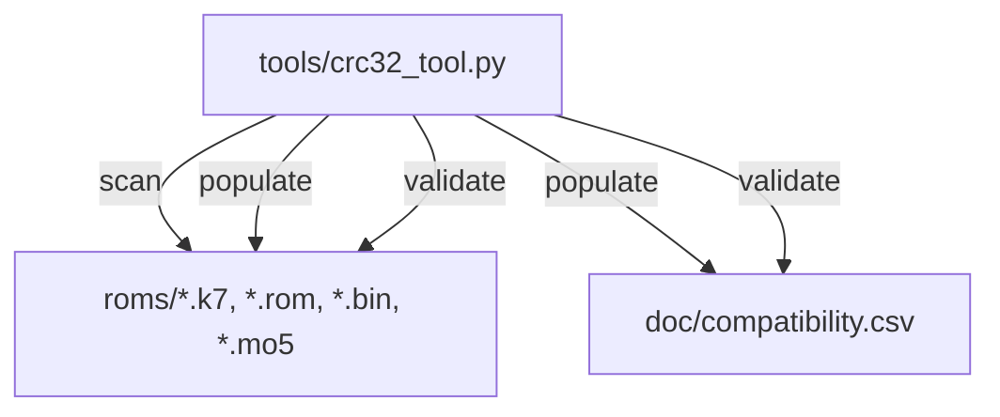

# Design Document: ROM Compatibility Database

## Overview

A CSV-based compatibility database (`doc/compatibility.csv`) and a Python CLI tool (`tools/crc32_tool.py`) for the Crayon MO5 emulator. The tool scans K7 cassette files and cartridge ROMs, computes CRC32 checksums, parses K7 headers to detect load type, and generates/validates the database.

Adapted from the Videopac emulator's compatibility database, simplified for MO5:
- No TOSEC zip archives — all files are loose in `roms/`
- No Gamelist — names derived from TOSEC-style filenames
- K7 header parsing to detect LOAD vs LOADM type
- Single platform (MO5)

## Architecture



### Modes

- **scan**: Compute CRC32 for files, print `filename CRC32` lines
- **populate**: Scan all files → parse names → detect load type → write CSV
- **validate**: Load CSV → scan files → compare → report mismatches

## Components

### CLI (`tools/crc32_tool.py`)

```
usage: crc32_tool.py {scan,populate,validate} ...

scan options:
  path              Path to file or directory

populate options:
  --roms-dir        Path to ROM directory (default: roms)
  --output          Output CSV path (default: doc/compatibility.csv)

validate options:
  --database        Path to CSV (default: doc/compatibility.csv)
  --roms-dir        Path to ROM directory (default: roms)
```

### CRC32 Module

```python
def compute_crc32(filepath: str) -> str:
    """Return 8-char uppercase hex CRC32."""

def scan_directory(dirpath: str) -> list[RomInfo]:
    """Recursively scan for .k7/.rom/.bin/.mo5 files."""
```

### K7 Header Parser

```python
def detect_load_type(filepath: str) -> str:
    """Parse K7 header block to determine load type.
    Returns 'LOAD' (BASIC), 'LOADM' (machine code), or 'unknown'."""
```

Reads the K7 file, finds the first header block (type 0x00), checks the file_type byte:
- 0x00 → BASIC → `LOAD`
- 0x02 → machine code → `LOADM`
- other → `unknown`

### Name Parser

```python
def parse_game_name(filename: str) -> str:
    """Extract game title from TOSEC-style filename.
    'Yeti (1984) (Loriciels).k7' → 'Yeti'
    'Air Attack (1985) (Microids).k7' → 'Air Attack'
    """
```

Strips extension, takes everything before the first `(`.

## Data Models

### RomInfo

```python
@dataclass
class RomInfo:
    filename: str
    crc32: str
    size: int
    file_type: str      # "k7" or "cartridge"
    load_type: str      # "LOAD", "LOADM", "cartridge", "unknown"
```

### CsvRow

```python
@dataclass
class CsvRow:
    crc32: str
    name: str
    filename: str
    size: int
    type: str           # "k7" or "cartridge"
    load_type: str
    status: str
    notes: str
```

### CSV Format

```csv
crc32,name,filename,size,type,load_type,status,notes
A1B2C3D4,Yeti,Yeti (1984) (Loriciels).k7,38109,k7,LOAD,not_tested,
```

## Correctness Properties

### Property 1: CSV Round-Trip Preservation
For any list of CsvRow entries, write→read produces equivalent entries.

### Property 2: CRC32 Format Invariant
For any byte sequence, CRC32 is exactly 8 uppercase hex characters.

### Property 3: Deduplication Uniqueness
After dedup, every CRC32 appears exactly once.

### Property 4: Sort Invariant
Entries are sorted alphabetically by name (case-insensitive).

### Property 5: Name Resolution Always Non-Empty
Every entry has a non-empty name after parsing.

### Property 6: New Entries Default to not_tested
Every populated entry has status `not_tested`.

### Property 7: Scan Completeness
Scan returns one entry per matching file.

### Property 8: Validation Detects All Mismatches
All CRC mismatches between DB and disk are reported.

## Error Handling

- Unreadable files: log warning, skip, continue
- Missing CSV in validate mode: exit with error
- K7 with no header block: load_type = `unknown`
- Exit codes: 0 success, 1 fatal, 2 warnings
