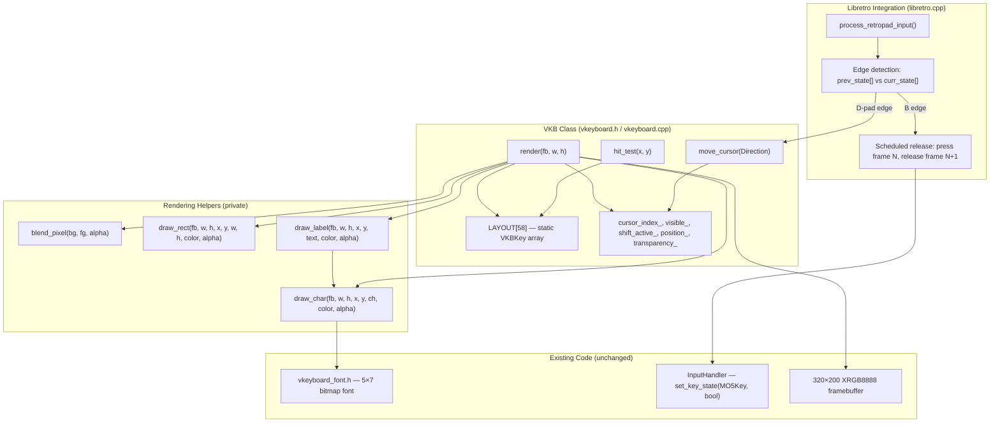

# Design Document: VKB Rewrite

## Overview

This design rewrites the Virtual Keyboard (VKB) overlay for the Crayon MO5 libretro core, replacing the current grid-based layout with a pixel-positioned, nav-link-driven architecture inspired by the Videopac emulator's proven VKB implementation.

The key architectural shift: instead of computing key positions from `(row, col)` grid indices and using `clamp_cursor()` for navigation, each key stores its absolute pixel rectangle and explicit indices to its four directional neighbors. This eliminates broken cursor wrapping at row boundaries and enables non-uniform key sizes (e.g., the wide SPACE bar) without special-case logic.

The VKB renders procedurally into the existing 320×200 XRGB8888 framebuffer using filled rectangles and the existing 5×7 bitmap font. No SDL dependency, no external assets. The libretro integration layer handles edge-detected input and scheduled key release, keeping the VKB class itself frontend-agnostic.

## Architecture



The VKB class owns layout data and rendering logic. The libretro layer owns input polling, edge detection, and the scheduled-release mechanism. Communication is through the VKB's public API: `move_cursor()`, `press_selected()`, `hit_test()`, `render()`.

## Components and Interfaces

### VKBKey Struct

```cpp
struct VKBKey {
    const char* label;  // Display text (e.g., "STP", "A", "SPACE")
    int x;              // Left edge in pixels (relative to VKB origin)
    int y;              // Top edge in pixels (relative to VKB origin)
    int width;          // Key width in pixels
    int height;         // Key height in pixels
    MO5Key mo5_key;     // MO5 scancode
    int nav_up;         // Index into LAYOUT[], or -1
    int nav_down;       // Index into LAYOUT[], or -1
    int nav_left;       // Index into LAYOUT[], or -1
    int nav_right;      // Index into LAYOUT[], or -1
};
```

### Direction Enum

```cpp
enum class Direction { Up, Down, Left, Right };
```

### VirtualKeyboard Class — Public Interface

```cpp
class VirtualKeyboard {
public:
    VirtualKeyboard();

    // Visibility
    void toggle_visible();
    bool is_visible() const;

    // Navigation
    void move_cursor(Direction dir);
    MO5Key press_selected() const;
    int get_cursor_index() const;

    // Touch/pointer
    int hit_test(int x, int y) const;
    MO5Key get_key_at(int index) const;

    // Modifiers
    void toggle_shift();
    bool is_shift_active() const;

    // Position
    void toggle_position();
    void set_position(VKBPosition pos);
    VKBPosition get_position() const;

    // Transparency
    void set_transparency(VKBTransparency t);
    VKBTransparency get_transparency() const;

    // Rendering
    void render(uint32_t* framebuffer, int fb_width, int fb_height) const;

    // Layout access
    static constexpr int KEY_COUNT = 58;
    static const VKBKey LAYOUT[KEY_COUNT];

    // VKB dimensions
    static constexpr int VKB_WIDTH = 302;
    static constexpr int VKB_HEIGHT = 93;

private:
    int cursor_index_ = 0;
    bool visible_ = false;
    bool shift_active_ = false;
    VKBPosition position_ = VKBPosition::Bottom;
    VKBTransparency transparency_ = VKBTransparency::Opaque;

    int get_y_offset(int fb_height) const;
    uint32_t blend_pixel(uint32_t bg, uint32_t fg, uint8_t alpha) const;
    void draw_rect(uint32_t* fb, int fb_w, int fb_h,
                   int x, int y, int w, int h,
                   uint32_t color, uint8_t alpha) const;
    void draw_char(uint32_t* fb, int fb_w, int fb_h,
                   int x, int y, char ch,
                   uint32_t color, uint8_t alpha) const;
    void draw_label(uint32_t* fb, int fb_w, int fb_h,
                    int x, int y, const char* text,
                    uint32_t color, uint8_t alpha) const;
};
```

### Rendering Pipeline

`render()` executes in this order:
1. Early return if `!visible_` or `framebuffer == nullptr`
2. Compute `y_offset` from position and fb_height
3. Compute alpha from transparency level
4. Draw panel background: `draw_rect(0, 0, VKB_WIDTH, VKB_HEIGHT, PANEL_COLOR, alpha)`
5. For each key in `LAYOUT[0..57]`:
   a. Determine face color:
      - If `i == cursor_index_`: use `CURSOR` face + `CURSOR_TEXT` label
      - Else if key is SHIFT and `shift_active_`: use `CURSOR` face (shift indicator)
      - Else if key is SHIFT: use `KEY_SHIFT` face, skip label (yellow key, no text)
      - Else if key is BASIC: use `KEY_BASIC` face + `TEXT` label
      - Else: use `KEY_FACE` face + `TEXT` label
   b. `draw_rect` for key border (full key rect in border color)
   c. `draw_rect` for key face (inset by 1px in face color)
   d. Compute label centering: `text_x = key.x + (key.width - text_pixel_width) / 2`, `text_y = key.y + (key.height - 7) / 2`
   e. `draw_label` with appropriate text color (skip if SHIFT key without cursor)

### Helper Methods

`blend_pixel(bg, fg, alpha)`: Standard alpha compositing. `out = (fg * alpha + bg * (255 - alpha)) / 255` per channel. Returns XRGB8888.

`draw_rect(fb, fb_w, fb_h, x, y, w, h, color, alpha)`: Fills a rectangle at `(x + x_offset, y + y_offset)` in the framebuffer using `blend_pixel` for each pixel. Clips to framebuffer bounds.

`draw_char(fb, fb_w, fb_h, x, y, ch, color, alpha)`: Renders one 5×7 glyph from `FONT_DATA[ch - 32]`, blending set pixels with `blend_pixel`.

`draw_label(fb, fb_w, fb_h, x, y, text, color, alpha)`: Iterates characters, calling `draw_char` with 6px horizontal stride (5px glyph + 1px gap).

### hit_test Method

```
hit_test(x, y):
    y_offset = get_y_offset(fb_height)  // needs fb_height context — see note
    adjusted_y = y - y_offset
    for i in 0..KEY_COUNT-1:
        if x >= LAYOUT[i].x && x < LAYOUT[i].x + LAYOUT[i].width &&
           adjusted_y >= LAYOUT[i].y && adjusted_y < LAYOUT[i].y + LAYOUT[i].height:
            return i
    return -1
```

Note: `hit_test` needs to know `fb_height` to compute the y offset. The signature becomes `hit_test(int x, int y, int fb_height) const`.

### move_cursor Method

```
move_cursor(Direction dir):
    switch (dir):
        Up:    next = LAYOUT[cursor_index_].nav_up
        Down:  next = LAYOUT[cursor_index_].nav_down
        Left:  next = LAYOUT[cursor_index_].nav_left
        Right: next = LAYOUT[cursor_index_].nav_right
    if next != -1:
        cursor_index_ = next
```

### Libretro Integration — Edge Detection

In `libretro.cpp`, the integration layer tracks previous-frame state for each VKB-relevant button:

```cpp
static bool prev_up, prev_down, prev_left, prev_right;
static bool prev_b, prev_a, prev_y, prev_select;

// In process_retropad_input():
bool cur_up = input_state_cb(0, RETRO_DEVICE_JOYPAD, 0, RETRO_DEVICE_ID_JOYPAD_UP) != 0;
if (cur_up && !prev_up) g_vkb.move_cursor(Direction::Up);
prev_up = cur_up;
// ... same pattern for all buttons
```

### Libretro Integration — Scheduled Release

```cpp
static bool g_vkb_key_pending = false;
static MO5Key g_vkb_pending_key;
static bool g_vkb_pending_shift;

// At start of each frame, release previous key:
if (g_vkb_key_pending) {
    input.set_key_state(g_vkb_pending_key, false);
    if (g_vkb_pending_shift)
        input.set_key_state(MO5Key::SHIFT, false);
    g_vkb_key_pending = false;
}

// On B edge while VKB visible:
MO5Key key = g_vkb.press_selected();
bool shift = g_vkb.is_shift_active();
if (shift) input.set_key_state(MO5Key::SHIFT, true);
input.set_key_state(key, true);
g_vkb_key_pending = true;
g_vkb_pending_key = key;
g_vkb_pending_shift = shift;
if (shift) g_vkb.toggle_shift();
```


## Data Models

### VKB Dimensions

- VKB_WIDTH: 302 pixels (15 keys × 20px + 2px left margin)
- VKB_HEIGHT: 93 pixels (5 rows × 18px spacing + 3px padding)
- Row height: 17 pixels per key
- Key unit width: 20 pixels (standard key)
- Special widths: ENTER 22px, BASIC 40px, SPACE 160px

### Layout Coordinate System

All key coordinates are relative to the VKB's top-left corner (0, 0). The `get_y_offset()` method adds the vertical offset based on position (0 for Top, `fb_height - VKB_HEIGHT` for Bottom).

Row vertical positions (18px spacing):
- Row 0: y = 2
- Row 1: y = 20
- Row 2: y = 38
- Row 3: y = 56
- Row 4: y = 74

### Color Constants

The color scheme matches the authentic Thomson MO5 keyboard appearance:
- Most keys: gray face with white text
- SHIFT key: yellow face, no label text
- BASIC key: black face with white text
- Cursor highlight: bright yellow border/outline around the selected key
- Panel background: dark (near-black)

Only the primary character label is shown per key (single line, white text). The secondary BASIC command labels from the real keyboard are omitted — they don't fit at 320×200 resolution.

```cpp
namespace vkb_colors {
    constexpr uint32_t PANEL      = 0x00181818;  // Near-black background
    constexpr uint32_t KEY_FACE   = 0x00606060;  // Gray (most keys)
    constexpr uint32_t KEY_SHIFT  = 0x00CCCC00;  // Yellow (SHIFT key)
    constexpr uint32_t KEY_BASIC  = 0x00101010;  // Black (BASIC key)
    constexpr uint32_t BORDER     = 0x00404040;  // Dark gray border
    constexpr uint32_t CURSOR     = 0x00FFCC00;  // Yellow cursor highlight
    constexpr uint32_t TEXT       = 0x00FFFFFF;  // White text
    constexpr uint32_t CURSOR_TEXT = 0x00000000; // Black text on cursor
}
```

The rendering pipeline selects the face color per key:
- If `i == cursor_index_`: use `CURSOR` face + `CURSOR_TEXT` label
- Else if key is SHIFT and `shift_active_`: use `CURSOR` face (visual indicator)
- Else if key is SHIFT: use `KEY_SHIFT` face, no label
- Else if key is BASIC: use `KEY_BASIC` face + `TEXT` label
- Else: use `KEY_FACE` face + `TEXT` label

### Complete 58-Key LAYOUT Array

Key indices 0–57. Nav links reference these indices. `-1` means no neighbor.

Layout matches the physical Thomson MO5 keyboard (verified against photo):
- Row 0: STOP, digits 1-9, 0, -, =, ACC, ↑ (15 keys)
- Row 1: CNT, A, Z, E, R, T, Y, U, I, O, P, /, *, ←, → (15 keys)
- Row 2: RAZ, ↵(ACC2), Q, S, D, F, G, H, J, K, L, M, ENTRÉE(wide), ↓ (14 keys)
- Row 3: SHIFT(yellow), W, X, C, V, B, N, comma, period, @, BASIC(wide,black), INS, EFF (13 keys)
- Row 4: SPACE (1 wide key)

Layout geometry: 2px left margin, 20px per standard key width, 18px row height, 2px top padding.

```
Index | Key     | Label | x   | y  | w  | h  | nav_up | nav_down | nav_left | nav_right
------|---------|-------|-----|----|----|----| -------|----------|----------|----------
Row 0 (15 keys): y=2, h=17
  0   | STOP    | STP   |   2 |  2 | 20 | 17 |  -1 | 15  |  -1 |   1
  1   | Key1    | 1     |  22 |  2 | 20 | 17 |  -1 | 16  |   0 |   2
  2   | Key2    | 2     |  42 |  2 | 20 | 17 |  -1 | 17  |   1 |   3
  3   | Key3    | 3     |  62 |  2 | 20 | 17 |  -1 | 18  |   2 |   4
  4   | Key4    | 4     |  82 |  2 | 20 | 17 |  -1 | 19  |   3 |   5
  5   | Key5    | 5     | 102 |  2 | 20 | 17 |  -1 | 20  |   4 |   6
  6   | Key6    | 6     | 122 |  2 | 20 | 17 |  -1 | 21  |   5 |   7
  7   | Key7    | 7     | 142 |  2 | 20 | 17 |  -1 | 22  |   6 |   8
  8   | Key8    | 8     | 162 |  2 | 20 | 17 |  -1 | 23  |   7 |   9
  9   | Key9    | 9     | 182 |  2 | 20 | 17 |  -1 | 24  |   8 |  10
 10   | Key0    | 0     | 202 |  2 | 20 | 17 |  -1 | 25  |   9 |  11
 11   | MINUS   | -     | 222 |  2 | 20 | 17 |  -1 | 26  |  10 |  12
 12   | PLUS    | +     | 242 |  2 | 20 | 17 |  -1 | 27  |  11 |  13
 13   | ACC     | ACC   | 262 |  2 | 20 | 17 |  -1 | 28  |  12 |  14
 14   | UP      | ^     | 272 |  2 | 20 | 17 |  -1 | 29  |  13 |  -1

Row 1 (16 keys): y=20, h=17
 15   | CNT     | CNT   |   2 | 20 | 20 | 17 |   0 | 30  |  -1 |  16
 16   | A       | A     |  22 | 20 | 20 | 17 |   1 | 32  |  15 |  17
 17   | Z       | Z     |  42 | 20 | 20 | 17 |   2 | 33  |  16 |  18
 18   | E       | E     |  62 | 20 | 20 | 17 |   3 | 34  |  17 |  19
 19   | R       | R     |  82 | 20 | 20 | 17 |   4 | 35  |  18 |  20
 20   | T       | T     | 102 | 20 | 20 | 17 |   5 | 36  |  19 |  21
 21   | Y       | Y     | 122 | 20 | 20 | 17 |   6 | 37  |  20 |  22
 22   | U       | U     | 142 | 20 | 20 | 17 |   7 | 38  |  21 |  23
 23   | I       | I     | 162 | 20 | 20 | 17 |   8 | 39  |  22 |  24
 24   | O       | O     | 182 | 20 | 20 | 17 |   9 | 40  |  23 |  25
 25   | P       | P     | 202 | 20 | 20 | 17 |  10 | 41  |  24 |  26
 26   | SLASH   | /     | 222 | 20 | 20 | 17 |  11 | 42  |  25 |  27
 27   | STAR    | *     | 242 | 20 | 20 | 17 |  12 | 42  |  26 |  28
 28   | LEFT    | <-    | 262 | 20 | 20 | 17 |  13 | 43  |  27 |  29
 29   | RIGHT   | ->    | 282 | 20 | 20 | 17 |  14 | 43  |  28 |  -1

Row 2 (14 keys): y=38, h=17
 30   | RAZ     | RAZ   |   2 | 38 | 20 | 17 |  15 | 44  |  -1 |  31
 31   | ACC2    | AC2   |  22 | 38 | 20 | 17 |  16 | 45  |  30 |  32
 32   | Q       | Q     |  42 | 38 | 20 | 17 |  17 | 46  |  31 |  33
 33   | S       | S     |  62 | 38 | 20 | 17 |  18 | 47  |  32 |  34
 34   | D       | D     |  82 | 38 | 20 | 17 |  19 | 48  |  33 |  35
 35   | F       | F     | 102 | 38 | 20 | 17 |  20 | 49  |  34 |  36
 36   | G       | G     | 122 | 38 | 20 | 17 |  21 | 50  |  35 |  37
 37   | H       | H     | 142 | 38 | 20 | 17 |  22 | 51  |  36 |  38
 38   | J       | J     | 162 | 38 | 20 | 17 |  23 | 52  |  37 |  39
 39   | K       | K     | 182 | 38 | 20 | 17 |  24 | 53  |  38 |  40
 40   | L       | L     | 202 | 38 | 20 | 17 |  25 | 54  |  39 |  41
 41   | M       | M     | 222 | 38 | 20 | 17 |  26 | 54  |  40 |  42
 42   | ENTER   | ENT   | 242 | 38 | 22 | 17 |  27 | 55  |  41 |  43
 43   | DOWN    | v     | 272 | 38 | 20 | 17 |  28 | 56  |  42 |  -1

Row 3 (13 keys): y=56, h=17
 44   | SHIFT   |       |   2 | 56 | 20 | 17 |  30 | 57  |  -1 |  45
 45   | W       | W     |  22 | 56 | 20 | 17 |  31 | 57  |  44 |  46
 46   | X       | X     |  42 | 56 | 20 | 17 |  32 | 57  |  45 |  47
 47   | C       | C     |  62 | 56 | 20 | 17 |  33 | 57  |  46 |  48
 48   | V       | V     |  82 | 56 | 20 | 17 |  34 | 57  |  47 |  49
 49   | B       | B     | 102 | 56 | 20 | 17 |  35 | 57  |  48 |  50
 50   | N       | N     | 122 | 56 | 20 | 17 |  36 | 57  |  49 |  51
 51   | COMMA   | ,     | 142 | 56 | 20 | 17 |  37 | 57  |  50 |  52
 52   | DOT     | .     | 162 | 56 | 20 | 17 |  38 | 57  |  51 |  53
 53   | AT      | @     | 182 | 56 | 20 | 17 |  39 | 57  |  52 |  54
 54   | BASIC   | BAS   | 202 | 56 | 40 | 17 |  40 | 57  |  53 |  55
 55   | INS     | INS   | 242 | 56 | 20 | 17 |  42 |  -1 |  54 |  56
 56   | EFF     | EFF   | 262 | 56 | 20 | 17 |  43 |  -1 |  55 |  -1

Row 4 (1 key): y=74, h=17
 57   | SPACE   | SPC   |  62 | 74 |120 | 17 |  47 |  -1 |  -1 |  -1
```

Note: SHIFT key (index 44) has empty label — rendered as yellow face with no text.
BASIC key (index 54) is wider (40px) and rendered with black face.
ENTER key (index 42) is slightly wider (22px).
SPACE key (index 57) spans 8 standard key widths, centered.

### Enums (unchanged from current)

```cpp
enum class VKBPosition { Bottom, Top };
enum class VKBTransparency { Opaque, SemiTransparent, Transparent };
```

### State Variables

| Field | Type | Default | Description |
|-------|------|---------|-------------|
| cursor_index_ | int | 0 | Index into LAYOUT[] of the currently highlighted key |
| visible_ | bool | false | Whether the VKB is rendered |
| shift_active_ | bool | false | Whether SHIFT modifier is toggled on |
| position_ | VKBPosition | Bottom | Top or bottom of framebuffer |
| transparency_ | VKBTransparency | Opaque | Alpha level for rendering |


## Correctness Properties

*A property is a characteristic or behavior that should hold true across all valid executions of a system — essentially, a formal statement about what the system should do. Properties serve as the bridge between human-readable specifications and machine-verifiable correctness guarantees.*

### Property 1: Layout geometry invariant

*For any* key in the LAYOUT array, the key SHALL have positive width and height, non-negative x and y, and `x + width <= 320` and `y + height <= VKB_HEIGHT`.

**Validates: Requirements 2.3, 2.4**

### Property 2: Layout covers all MO5 scancodes

*For any* MO5Key enum value (0x00 through 0x39), there SHALL exist exactly one entry in the LAYOUT array with that scancode, and the LAYOUT array SHALL have exactly 58 entries.

**Validates: Requirements 1.3, 2.1**

### Property 3: Nav link validity

*For any* key in the LAYOUT array and any direction (up, down, left, right), the nav link value SHALL be either -1 or a valid index in the range [0, 57].

**Validates: Requirements 1.1, 1.2**

### Property 4: Move cursor follows nav links

*For any* key index `i` in [0, 57] and any Direction `d`, if `LAYOUT[i]`'s nav link for direction `d` is a valid index `j` (not -1), then after setting `cursor_index_ = i` and calling `move_cursor(d)`, the cursor index SHALL equal `j`.

**Validates: Requirements 5.1**

### Property 5: Move cursor stays on -1 nav link

*For any* key index `i` in [0, 57] and any Direction `d`, if `LAYOUT[i]`'s nav link for direction `d` is -1, then after setting `cursor_index_ = i` and calling `move_cursor(d)`, the cursor index SHALL remain `i`.

**Validates: Requirements 1.2, 5.4**

### Property 6: Hit test correctness

*For any* key index `i` in [0, 57] and any point `(px, py)` strictly inside that key's bounding rectangle (i.e., `LAYOUT[i].x <= px < LAYOUT[i].x + LAYOUT[i].width` and `LAYOUT[i].y <= py < LAYOUT[i].y + LAYOUT[i].height`), `hit_test(px, py + y_offset)` SHALL return `i`. Conversely, for any point not inside any key's bounding rectangle, `hit_test` SHALL return -1.

**Validates: Requirements 7.1, 7.2, 7.3**

### Property 7: No key overlap

*For any* two distinct keys `i` and `j` in the LAYOUT array, their bounding rectangles SHALL NOT overlap. This ensures hit_test is unambiguous.

**Validates: Requirements 7.2**

### Property 8: Press selected returns correct key

*For any* valid cursor index `i` in [0, 57], `press_selected()` SHALL return `LAYOUT[i].mo5_key`.

**Validates: Requirements 6.1**

### Property 9: Toggle visible round trip

*For any* initial visibility state, calling `toggle_visible()` twice SHALL restore the original visibility state.

**Validates: Requirements 10.1**

### Property 10: Hidden render is no-op

*For any* framebuffer content, when the VKB is not visible, calling `render()` SHALL leave every pixel in the framebuffer unchanged.

**Validates: Requirements 10.2**

### Property 11: Toggle position round trip

*For any* initial position state, calling `toggle_position()` twice SHALL restore the original position.

**Validates: Requirements 8.2**

### Property 12: Position affects hit test offset

*For any* key and any point within that key's bounds, `hit_test` SHALL return the correct index when the VKB is at Bottom position (y_offset = fb_height - VKB_HEIGHT) and SHALL return -1 for the same absolute coordinates when the VKB is at Top position (y_offset = 0), unless the point also falls within the key's bounds at the top offset.

**Validates: Requirements 8.4**

### Property 13: Transparency affects blending

*For any* non-black background pixel and any VKB element color, rendering at Opaque (alpha=255) SHALL produce a different pixel value than rendering at Transparent (alpha=80) on the same background.

**Validates: Requirements 9.2**

### Property 14: Cursor highlight rendering

*For any* valid cursor index `i`, after rendering, at least one pixel within the bounding rectangle of `LAYOUT[i]` SHALL contain the cursor highlight color (0x00FFCC00) when transparency is Opaque.

**Validates: Requirements 4.2**

## Error Handling

The VKB is a self-contained overlay with minimal failure modes:

| Scenario | Handling |
|----------|----------|
| `render()` called with null framebuffer | Early return, no-op |
| `render()` called when not visible | Early return, no-op |
| `move_cursor()` with nav link = -1 | Cursor stays on current key |
| `hit_test()` with out-of-bounds coordinates | Returns -1 |
| `cursor_index_` somehow out of range | Clamp to [0, KEY_COUNT-1] in `press_selected()` and `render()` |
| Key label is nullptr | `draw_label()` handles null by skipping |
| Framebuffer dimensions smaller than VKB | Rendering clips to framebuffer bounds via bounds checks in `draw_rect`, `draw_char` |

No exceptions are thrown. No dynamic allocation occurs. All error paths are silent and safe.

## Testing Strategy

### Property-Based Testing

Library: [rapidcheck](https://github.com/emil-e/rapidcheck) (C++ property-based testing, integrates with Google Test which is already in `ext/googletest`).

Each correctness property maps to one property-based test with a minimum of 100 iterations. Tests are tagged with comments referencing the design property:

```cpp
// Feature: vkb-rewrite, Property 4: Move cursor follows nav links
RC_GTEST_PROP(VKBNavigation, MoveCursorFollowsNavLinks, ()) {
    auto key_idx = *rc::gen::inRange(0, 58);
    auto dir = *rc::gen::element(Direction::Up, Direction::Down, Direction::Left, Direction::Right);
    // ... test body
}
```

Configuration: `RC_PARAMS(numTests=200)` to exceed the 100-iteration minimum.

### Unit Tests

Unit tests complement property tests for specific examples and edge cases:

- Layout structure: verify specific key positions (e.g., STOP is at index 0, SPACE is at index 57)
- Row arrangement: verify Row 0 starts with STOP and ends with EFF, Row 1 starts with CNT, etc.
- Color scheme: render with known cursor position, verify specific pixel colors
- SHIFT visual indicator: toggle shift, render, verify SHIFT key uses highlight color
- Default state: new VirtualKeyboard is hidden, bottom position, opaque, cursor at 0
- ENTER key width: verify ENTER (index 28) has width > standard key width
- SPACE key width: verify SPACE (index 57) spans multiple key units
- Blend pixel edge cases: alpha=0 returns bg, alpha=255 returns fg
- Hit test boundary: test exact edge pixels of a key (inclusive left/top, exclusive right/bottom)

### Test Organization

```
tests/
  test_vkeyboard.cpp       — unit tests (Google Test)
  test_vkeyboard_props.cpp  — property tests (rapidcheck + Google Test)
```

Both test files include `vkeyboard.h` and test the VirtualKeyboard class directly. No libretro dependencies needed — the VKB class is frontend-agnostic by design (Requirement 11).

Integration-level behavior (edge detection, scheduled release) is tested manually through the libretro frontend, as it depends on `input_state_cb` which cannot be easily mocked in unit tests.
