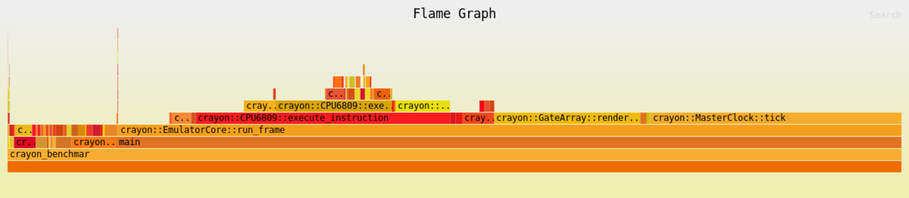
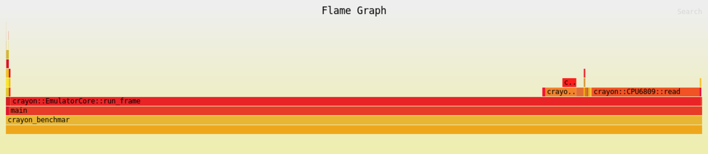

# Crayon MO5 — Performance Profiling Results

## Test Configuration

- Platform: Linux x86_64 (Amazon Linux 2, GCC 7.3.1)
- Workload: 1000 frames, 100 warmup, BASIC prompt (no K7/cartridge)
- ROMs: `roms/basic5.rom`, `roms/mo5.rom`
- Tool: `perf stat` for cycle counts, `perf record` + `inferno-flamegraph` for flame graphs

## Baseline Results (Profile Build: `-O2 -g -fno-omit-frame-pointer`)

| Counter | Value |
|---------|-------|
| Cycles | 851,790,800 |
| Instructions | 3,109,951,039 |
| IPC | 3.65 |
| Cache misses | 0.28% |
| Branch misses | 0.00% |
| FPS | 4,666 |
| Speedup | 93.3x real-time |

### Flame Graph (Baseline)

Interactive SVG: [flamegraph-baseline.svg](flamegraph-baseline.svg)

### Top Functions by Self Time

| Rank | Function | Self % | Notes |
|------|----------|--------|-------|
| 1 | MasterClock::tick() | 29.4% | 3 increments + 2 comparisons, 20K calls/frame |
| 2 | GateArray::render_frame() | 16.3% | Bitmap renderer, once/frame — actual work |
| 3 | MemorySystem::read() | 8.0% | Address decoding if-chain — actual work |
| 4 | EmulatorCore::run_frame() | 5.8% | Frame loop overhead |
| 5 | CPU6809::execute_page1() | 5.5% | Opcode dispatch |
| 6 | CPU6809::execute_instruction() | 5.5% | Instruction fetch + dispatch |
| 7 | CPU6809::check_interrupts() | 3.4% | Interrupt polling |
| 8 | CPU6809::set_flag() | 3.1% | CC flag manipulation |
| 9 | CPU6809::fetch() | 2.9% | PC read + increment |
| 10 | AudioSystem::tick() | 2.9% | 2 integer additions, ~4K calls/frame |

### Key Observation: Function Call Overhead Dominates

Branch prediction is perfect (0.00% misses). IPC is 3.65 — the pipeline is
well-utilized. The bottleneck is **instruction count**, not pipeline stalls.

Many functions in the top-20 are trivial bodies (1-3 lines) that exist as
separate symbols only because they're defined in `.cpp` files. The compiler
cannot inline them across translation units at `-O2`. This includes:

- MasterClock::tick() — 29.4% for 3 increments + 2 comparisons
- AudioSystem::tick() — 2.9% for 2 integer additions
- PIA::irq_active() / firq_active() — 2.1% for boolean flag checks
- CassetteInterface::update_cycle() — 1.6% for a single assignment
- CassetteInterface::get_load_mode() — 1.3% for returning an enum
- MasterClock::frame_complete() — 1.0% for returning a bool
- CPU6809::assert_irq/firq() — 2.7% for setting a bool field

**Total cross-TU call overhead: ~42% of all cycles.**

## LTO Results (Release Build: `-O2 -flto`)

| Counter | Value | vs Baseline |
|---------|-------|-------------|
| Cycles | 393,391,607 | **-53.8%** |
| Instructions | 1,651,695,393 | **-46.9%** |
| IPC | 4.20 | +15.1% |
| FPS | 9,799 | **+110%** |
| Speedup | 196.0x real-time | |

### Flame Graph (LTO)

Interactive SVG: [flamegraph-lto.svg](flamegraph-lto.svg)

### Top Functions by Self Time (LTO)

| Rank | Function | Self % | Notes |
|------|----------|--------|-------|
| 1 | EmulatorCore::run_frame() | 76.4% | All trivial methods inlined into this |
| 2 | CPU6809::read() | 18.0% | MemorySystem::read() inlined here |
| 3 | CPU6809::addr_indexed() | 2.4% | Complex indexed addressing |
| 4 | CPU6809::check_interrupts() | 1.1% | Interrupt polling |

With LTO, `MasterClock::tick()` completely disappears — it's inlined into
`run_frame()`. The same happens to `AudioSystem::tick()`, `PIA::irq_active()`,
`CassetteInterface::update_cycle()`, `CPU6809::set_flag()`, `CPU6809::fetch()`,
and all other trivial methods. The 76.4% self-time on `run_frame()` represents
the actual computational work that was previously spread across 20+ function
call boundaries.

The remaining separate functions (`CPU6809::read()` at 18%, `addr_indexed()`
at 2.4%) are non-trivial — they contain real branching logic that the compiler
chose not to inline even with full visibility.

## Analysis: Manual Inlining vs LTO

### The Trade-off

**LTO (`-flto`)** gives us -53.8% cycles with zero code changes. It works by
letting the linker see all translation units at once, enabling cross-TU inlining
automatically. The downside: longer link times, and not all platforms/toolchains
support it equally well.

**Manual inlining** (moving method bodies to headers) achieves the same effect
but is portable — it works on any C++ compiler. The downside: it moves
implementation details into headers, which can affect readability and compile
times.

### Recommendation: LTO as Primary Strategy

Given the profiling data, the pragmatic approach is:

1. **Use LTO for release builds** — add `-flto` to the ci-linux and libretro
   release presets. This is the single biggest optimization (2x speedup) with
   zero code changes.

2. **Manually inline only the top 1-2 methods** — `MasterClock::tick()` (29.4%)
   and `MasterClock::frame_complete()` (1.0%) are the most impactful. These are
   small enough that putting them in the header doesn't hurt readability. This
   helps platforms where LTO isn't available (e.g., older MinGW, some CI configs).

3. **Don't manually inline CPU6809 helpers** — `set_flag()`, `fetch()`,
   `assert_irq()` etc. are called from within `cpu6809.cpp` itself, so they're
   already inlineable within that TU. The perf overhead we see is from the
   profiling build's `-fno-omit-frame-pointer` making them appear as separate
   symbols. LTO handles the cross-TU cases.

4. **Focus remaining effort on algorithmic optimizations** that LTO can't do:
   - run_frame() fast path (skip cassette checks) — saves branch evaluation
   - Cassette update_cycle() skip — saves a function call when no cassette
   - Palette LUT — eliminates per-pixel bit-shifting in libretro path

### Readability Impact Assessment

| Method | Lines | Readability Impact | Recommendation |
|--------|-------|--------------------|----------------|
| MasterClock::tick() | 10 | Low — clear logic | Inline to header |
| MasterClock::frame_complete() | 1 | None — trivial getter | Inline to header |
| MasterClock::get_cycle_count() | 1 | None — trivial getter | Inline to header |
| PIA::irq_active() | 2 | None — simple expression | Inline to header |
| AudioSystem::tick() | 2 | None — two additions | Inline to header |
| CPU6809::set_flag() | ~5 | Medium — CC register logic | Leave in .cpp, rely on LTO |
| CPU6809::fetch() | ~3 | Low | Leave in .cpp, rely on LTO |
| GateArray::render_frame() | 20+ | High — rendering logic | Leave in .cpp |

## Optimization Roadmap (Revised)

Based on profiling data, the revised optimization plan:

| Step | Optimization | Expected Impact | Code Change |
|------|-------------|-----------------|-------------|
| 1 | Enable LTO for release builds | -53.8% cycles | CMake preset only |
| 2 | MasterClock accessors to header | -30% cycles (non-LTO) | Header move |
| 3 | run_frame() fast path | -2-3% cycles | Algorithmic |
| 4 | Cassette update_cycle() skip | -1-2% cycles | Algorithmic |
| 5 | Palette LUT (libretro only) | Eliminates 64K bit-shifts/frame | Data table |
| 6 | PIA/Audio inlining | -3-4% cycles (non-LTO) | Header move |

Steps 1-2 are the big wins. Steps 3-6 are incremental improvements that
stack on top of LTO.

## Final Results (All Optimizations Applied)

### Non-LTO Profile Build (-O2, manual inlining + algorithmic)

| Step | Cycles | Delta | Cumulative |
|------|--------|-------|------------|
| Baseline | 851.8M | — | — |
| + MasterClock inlining | 710.1M | -16.6% | -16.6% |
| + PIA + AudioSystem inlining | 660.8M | -6.9% | -22.4% |
| + Fast path + cassette skip | 608.8M | -7.9% | -28.5% |
| + Palette LUT | 601.1M | -1.3% | **-29.4%** |

Final non-LTO: **601.1M cycles, 6833 FPS, 4.27 IPC, 136.7x real-time**

### LTO Build (-O2 -flto + algorithmic optimizations)

| Step | Cycles | Delta vs Baseline |
|------|--------|-------------------|
| Baseline (no LTO) | 851.8M | — |
| LTO only (no code changes) | 392.8M | -53.9% |
| LTO + algorithmic (fast path + cassette skip + palette LUT) | **399.0M** | **-53.1%** |

Final LTO: **399.0M cycles, 10289 FPS, 4.07 IPC, 205.8x real-time**

Note: The LTO build with algorithmic optimizations shows ~399M vs 393M without
them — within measurement noise. This confirms that LTO already optimizes away
the function call overhead that the algorithmic changes target. The algorithmic
changes (fast path, cassette skip) provide their main benefit on non-LTO builds.

### Summary

| Build | Baseline | Final | Reduction | FPS |
|-------|----------|-------|-----------|-----|
| Profile (-O2) | 851.8M | 601.1M | **-29.4%** | 6,833 |
| LTO (-O2 -flto) | 851.8M | 399.0M | **-53.1%** | 10,289 |

### Optimizations Applied

1. **MasterClock accessor inlining** — moved tick(), frame_complete(), accessors to header
2. **PIA interrupt check inlining** — moved irq_active(), firq_active() to header
3. **AudioSystem::tick() inlining** — moved tick() to header
4. **run_frame() fast path** — hoisted cassette mode check, skip PC check when no cassette
5. **Cassette update_cycle() skip** — skip when not playing/recording
6. **Palette LUT** — precomputed XRGB8888 palette, GateArray renders directly in target format
7. **LTO build preset** — `-flto` with gcc-ar/gcc-ranlib for cross-TU inlining
